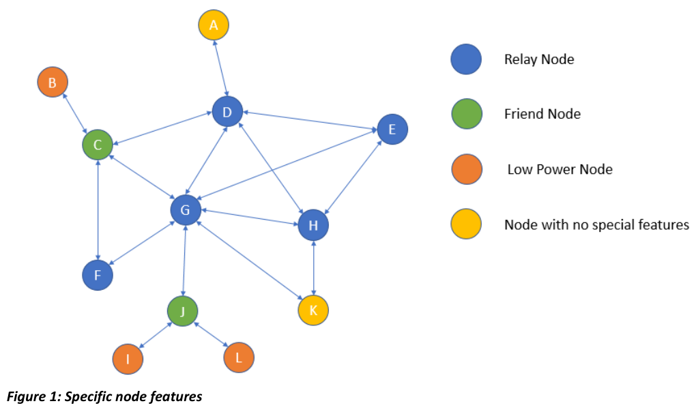

# Bluetooth Mesh Introduction

In July of 2017, the Bluetooth SIG released Mesh Profile Specification v1.0 which describes a mesh profile running on top of any device version 4.0 or newer.

> 2017年7月，蓝牙 SIG 联盟发布了[《Mesh Profile Specification v1.0》](https://www.bluetooth.com/specifications/mesh-specifications/)，该版本描述了在 4.0 版本或更高版本的任何设备上运行的 Mesh Profile。

Bluetooth has been actively developed since its initial release in 2000, when it was originally intended to act as a cable replacement technology. It soon came to dominate wireless audio products and computer peripherals such as wireless mice and keyboards.

> 自从 2000 年最初发布蓝牙以来，它就一直在积极发展，当时蓝牙最初旨在用作电缆替代技术。很快，它成为无线音频产品和计算机外围设备（如无线鼠标和键盘）的主导。

In 2010, Bluetooth LE provided the next, major step forward. Its impact has been substantial and widely felt, most notably in smartphones and tablets, as well as in Health and Fitness, Smart Home and Wearables categories.

> 在 2010 年，Bluetooth LE 向前迈出了重要的下一步。它的影响是巨大而广泛的，尤其是在智能手机和平板电脑以及健康和健身，智能家居和可穿戴设备类别中。

Wireless communications systems based around mesh network topologies have proved themselves to offer an effective approach to providing coverage of large areas, extending range and providing resilience. However, until now they have been based upon niche technologies, incompatible with most computer, smartphone and accessory devices owned by consumers or used in the enterprise.

> 事实证明，基于网状\(mesh\)网络拓扑的无线通信系统可以提供一种有效的方法来覆盖大范围，扩展范围并提供弹性。但是，直到现在，它们还是基于 niche 技术，与消费者拥有或企业使用的大多数计算机，智能手机和附件设备不兼容。

The addition of mesh networking support represents a change of a type, and of such magnitude that it warrants being described as a paradigm shift for Bluetooth technology.

> 网状\(mesh\)网络支持的增加代表了一种类型的变化，并且这种变化的程度足以保证将其描述为蓝牙技术的范式转变。

## Overview

A BLE mesh is a collection of up to **32,767 physical BLE devices** which send and receive messages to trigger predefined behaviors in the participating nodes.

> BLE mesh 是多达 **32,767 个物理 BLE 设备**的集合，这些设备发送和接收消息以触发参与节点中的预定义行为。

BLE mesh is a managed flood network which broadcasts \(BLE advertisement\) a message to other nodes that are in range. The receiving nodes re-broadcast \(or relay\) the message to other nodes that are also in range. This continues until the message time to live \(TTL\) expires; once expired, nodes that receive the message no longer re-broadcast it. If a node receives a message that it previously received, it can immediately discard it by matching it against entries in the message cache.

> BLE mesh 是一个受管理的泛洪网络，它向范围内的其他节点广播（BLE 广播）消息。接收节点将消息重新广播（或中继）到范围内的其他节点。这一直持续到消息生存时间（TTL）到期为止。一旦过期，接收到该消息的节点将不再重新广播它。如果节点接收到它先前收到的消息，则可以通过将其与消息缓存中的条目进行匹配来立即将其丢弃。

BLE mesh networks use relay nodes rather than nodes that function as routers. Routers can be a single point of failure that can then result in a full network failure. By not relying on routers, these mesh networks that use flooding are far more reliable. BLE mesh messages can be received from any node within range, even if an intermediary node fails or is removed from the network.

> BLE mesh 网络使用中继节点，而不是充当路由器的节点。路由器可以是单点故障，然后可能导致整个网络故障。通过不依赖路由器，这些使用泛洪的网状网络更加可靠。即使中间节点发生故障或已从网络中删除，BLE 消息也可以从范围内的任何节点接收。

Heartbeat messages are sent periodically to indicate a node is still alive and how many hops it may be from another node. This information can be used to optimise the TTL value.

> 心跳消息会定期发送，以指示一个节点仍处于活动状态，以及它可能来自另一个节点的跳数。此消息可用于优化 TTL 值。

BLE mesh does not make use of connections but rather uses the BLE broadcasts \(advertisements\) introduced with BT4.0. This does not mean that all BT4.0 devices automatically support mesh \(the OS likely needs to expose a new API\) but devices that are BT4.0 devices and newer have the potential to support BLE mesh.

> BLE mesh 不使用连接，而是使用 BT4.0 引入的 BLE 广播。这并不意味着所有 BT4.0 设备都自动支持网格（操作系统可能需要公开新的 API），但是 BT4.0 设备及更高版本的设备有可能支持 BLE mesh。

## Topology

All nodes in a BLE mesh can transmit and receive messages but some nodes may have one or more specific features.

* **Relay node** – Can receive and rebroadcast a message 
* **Low power node** – Spends most of its time in a low power state with its radio turned off 
* **Friend node** – Works alongside a low power node by storing and forwarding messages intended for a low power node when polled by the low power node 
* **Proxy node** – Devices without a mesh stack can interact with devices in a BLE mesh using a GATT bearer to a proxy node.

> BLE mesh 中的所有节点都可以发送和接收消息，但是某些节点可能具有一个或多个特定功能。
>
> * **中继节点** - 可以接收和重新广播（中继）消息
> * **低功耗节点** - 大部分时间都处于低功耗状态并且射频处于关闭状态
> * **友好节点 -** 通过在低功耗​​节点轮询时存储和转发发往低功耗节点的消息，与低功耗节点一起工作
> * **代理节点 -** 没有网格堆栈的设备可以使用代理节点的 GATT 承载与 BLE mesh 中的设备进行交互。

## Publish/Subscribe

**Messages are sent and received using a publish/subscribe paradigm.** An outgoing message is published. The only exception is when an acknowledgment message is sent to a specific node that received the behavior-invoking message. Given the advert-based, managed-flood nature of message transmission, the following is a valid question: How long does it take for the message to arrive at the destination? Anecdotally, the best answer is: messages travel at the speed of sound.

> **使用发布/订阅范式发送和接收消息。**外发消息已发布。唯一的例外是将确认消息发送到接收到行为调用消息的特定节点时。考虑到消息传递是基于广播的，管理洪水的性质，以下是一个有效的问题：消息到达目的地需要多长时间？有趣的是，最好的答案是：消息以声音的速度传播。

**Each message consists of an opcode and context data.** The opcode dictates the behavior at the receive end; the data can be **up to 380 octets**. By the time the application receives a mesh message, it is completely decrypted and given to the app as a plaintext message.

> **每个消息都包含一个操作码和上下文数据**。操作码指示接收端的行为；数据**最多可以包含 380 个八位位组**。 在应用程序收到网格消息时，它已被完全解密并作为纯文本消息提供给应用程序。

## Provisioning

When a mesh device is initially powered up, it is not provisioned. This means that it does not have a node address nor any other configuration information. In that state, when powered, it sends out **‘un-provisioned’ beacons** upon which a provisioner acts. To become part of a mesh network, the device must first be provisioned. **To do this, a mesh provisioner sends configuration information to the un-provisioned device.**

> mesh 设备第一次上电时，它是没有被配网的。这意味着它没有节点地址，也没有任何其他配置信息。在这种状态下，通电后，它将发出“未配置”的信标，配网器将根据该信标进行操作。要成为 mesh 网络的一部分，必须首先配置该设备。**为此，mesh 配网器会将配置信息发送到未配置的设备。**

**A provisioner is the only entity in a mesh** that 1\) is aware of **all the members of the network** and 2\) **knows how to program the publication address and the subscription lists of all the nodes** \(which enables the nodes to operate as a well-choreographed collective\). **Individual nodes are never aware of the full picture of the mesh network.**

> 配网器是 mesh 网络中唯一的实体，该实体1）知道网络的所有成员，2）知道如何对所有节点的发布地址和订阅列表进行编程（这使节点可以像编排的集体）。各个节点永远不会意识到网状网络的全貌。

For example, in an office commissioned with 50 lights and 20 switches, **only the provisioner is aware of the node addresses of all 70 devices.** The individual lights and switches have no need for this information. The provisioner creates group addresses for each office region then sets the publication addresses in the switches and the subscription addresses in the lights according to the applicable group address. When a light switch’s state changes, it publishes a group address and the applicable subscribed lights behave accordingly.

> 例如，在一个拥有 50 个灯和 20 个交换机的办公室中，**只有配网器知道所有 70 个设备的节点地址。**各个灯和开关不需要此信息。配网器为每个办公区域创建组地址，然后根据适用的组地址在交换机中设置发布地址，在灯光中设置订阅地址。当电灯开关的状态更改时，它会发布一个组地址，并且适用的订阅电灯也会相应地工作。

**A provisioner is not required for the network to function.** It is only required when nodes must be **added or removed \(blacklisted\)** from the network. Because of this, there is no central point of failure that could bring down the entire network.

> **Mesh 网络运行不需要配网器。**仅在必须从网络中**添加或删除节点**（将其列入黑名单）时才需要使用此功能。 因此，不存在可能导致整个网络瘫痪的中心故障点。

## Addressing

The term group address is simply an address value in the **range 0xC000 to 0xFEFF**. Consider it the topic field that is often mentioned in publish/subscribe communications schemes. For example, the provisioner arbitrarily decides that 0xC100 means meeting room, 0xC101 means storeroom, 0xC102 means the lobby, and so on. It configures the subscription addresses for the lights appropriately as one of those. There is no rulebook regarding how to assign those group addresses \(in the range 0xC000 to 0xFEFF\). The Bluetooth SIG does reserve some address values to allow messages to be sent to **All-nodes \(0xFFFF\)**, **All-relays \(0xFFFE\)**, **All-friends \(0xFFFD\)**, and **All-proxies \(0xFFFC\)**.

> 术语“组地址”仅是 **0xC000 至 0xFEFF** 范围内的地址值。考虑它是发布/订阅通信方案中经常提到的主题字段。 例如，提供者任意确定 0xC100 表示会议室，0xC101 表示储藏室，0xC102 表示大厅，依此类推。 它将灯光的订阅地址适当地配置为其中之一。 这里没有有关如何分配这些组地址（在 0xC000 到 0xFEFF 范围内）的规则手册。 蓝牙 SIG 确实保留了一些地址值，以允许将消息发送到**所有节点（0xFFFF）**，所有**中继节点（0xFFFE）**，所有**好友节点（0xFFFD）**和所有**代理节点（0xFFFC）**。

## Encryption

**By the time the messages are on the air, they have been encrypted twice.** Once with an application key and the second time with a network key. **Each key is 128-bit long and the encryption algorithm uses AES in CCM mode.** Because it does not have any knowledge of the keys, an outgoing message at the application layer is not encrypted. In addition, an application does not know or care about its own node address. When an application sends the message, the destination address is added and the encryption is performed by the underlying mesh stack. Critical information such as node address, app keys, net keys, publication address, subscription list, key bindings, and other configuration information is wholly managed by the smartBASIC firmware. This information is only available after a provisioner provisions the device into a network.

> **到消息广播时，它们已被加密两次。**一次使用应用程序密钥，第二次使用网络密钥。**每个密钥的长度为 128 位，并且加密算法在 CCM 模式下使用 AES。**由于它不了解任何密钥，因此不会加密应用程序层上的传出消息。另外，应用程序不知道或不在乎其自己的节点地址。当应用程序发送消息时，将添加目标地址，并由基础网格堆栈执行加密。 关键信息（例如节点地址，应用程序密钥，网络密钥，发布地址，订阅列表，密钥绑定和其他配置信息）完全由 smartBASIC 固件管理。仅在配网器将设备配置到网络中之后，此信息才可用。

