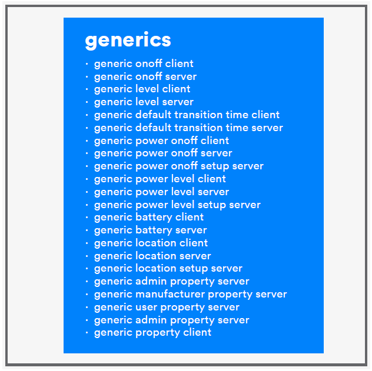
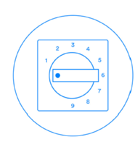
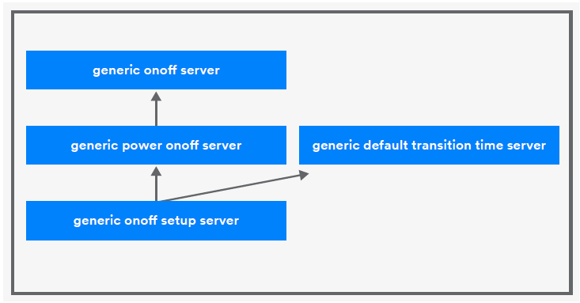
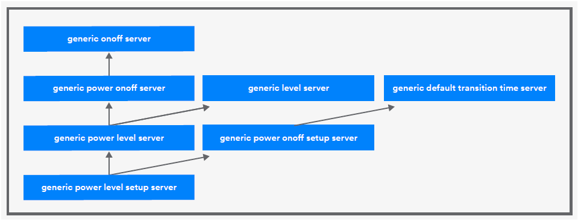
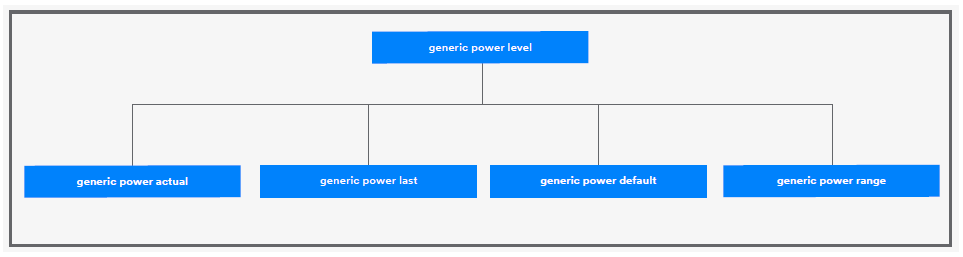

# A Guided Tour of Generic Models

As Figure 1 shows, there are 22 generic models relating to 8 states.

## The Generic OnOff Client and Server Models

### At a Glance 

The generic onoff models make it possible for one device to switch other devices on or off. 

### About These Models 

The server model contains one state only: the generic onoff state. This is a simple boolean state that indicates whether an element is currently switched on or off. A value of 0x00 means it is off, and a value of 0x01 means it is on. The generic onoff client may send generic onoff get, generic onoff set, or generic onoff set unacknowledged messages. It must be able to receive and handle generic status messages if it is able to send get or set \(acknowledged\) messages.

## The Generic Level Client and Server Models 

### At a Glance 

Some devices can be turned up or down; lights can be dimmed and the temperate of a room can be increased by turning up the thermostat. The generic level models allow control to be exercised over the level of other devices. 

### About These Models 

The generic level server model contains a state called generic level that can be positive or negative and has a range of -32,767 to +32,767. 

Different products may need to approach level control in different ways, such as from a user interface point of view. Imagine a 9-position rotary switch like the one in Figure 2.

Consider the similarities and differences between this type of level controller, with its 9 fixed choices of position and an analogue rotary control that allows the position to be set anywhere through a continuous range. 

In either case, the control needs to implement the generic level client model. 

The fixed position control in Figure 2 must divide the positive generic level value range into 9 equally spaced bands, mapping its 9 selectable levels to the generic level state values defined by the Bluetooth Mesh Model Specification. The values delineating the bands \(0, 3641, 7282, 10922, 14563, 18204, 21845, 25485, 29126\) are the level values sent in generic level set messages from the device. 

It might be tempting to think that the rotary control in Figure 3 will not need to perform this kind of value mapping, but it too will deliver values at a certain level of granularity and magnitude to the firmware of the device it is a part of, and they will need mapping to the generic level state’s value range in an appropriate way.

### Changing Levels 

Several ways of changing generic level are supported by the generic level models’ set and set unacknowledged messages. 

* **Generic level set** - changes the generic level state to an absolute value. 
* **Generic delta set** - changes the generic level state by a relative, positive, or negative amount. 
* **Generic move set** - initiates changing the generic level state in either a positive or negative direction and at a given speed. The speed with which the transition takes place is calculated from a delta level field in the message and a value known as the transition time. Transition time must either appear in the generic move set message itself, where it is an optional parameter, or be available in a state called the generic default transition time, which belongs to the generic default transition time model which may or may not be present. If transition time is not available from either of these two sources, the operation will not be executed and generic level will not be changed. 

The move transition may continue indefinitely. It will stop if a move set message with the delta level eldfi et so teroz s eicerived. heWn generic level reaches its upper or lower limit, during a move transition, the implementation may decide to either terminate the transition at that point or take some other action, such as wrapping around and continuing. 

Each of generic level set, generic delta set, and generic move set support the optional fields delay and transition time. 

The delay field allows the client to inform the server to defer execution of operation for a period of time after receiving the message. This can be helpful in synchronizing operations that affect multiple receiving devices. 

Transition time is used to calculate the speed with which a transition should take place. It encodes two data items, from which an elapsed time for the transition must be calculated. It is one octet in size and its 8 bits are used as follows:

| Field | Size \(bits\) | Definition |
| :--- | :--- | :--- |
| Default Transition Number of Steps | 6 | The Number of Steps |
| Default Transition Step Resolution | 2 | The resolution of the Default Transition |

The four values which transition step resolution may take represent 100 milliseconds \(0b00\), 1 second \(0b01\), 10 seconds \(0b10\), and 10 minutes \(0b11\), respectively. The transition time represented by this state is calculated by multiplying the number of steps and the time value represented by the step resolution. Durations from 0 seconds \(immediate\) to 10.5 hours can be encoded with the transition time state. 

The word “steps” might suggest that transitions should take place in a series of discreet increments/ decrements. This is not the case. The steps and step resolution fields are solely there to allow the calculation of the elapsed time of the transition. How the change manifests itself in user-visible ways is a product issue, and how the transition takes place in code is an implementation detail. 

Note that some level control requirements cannot be completely met by the simple, generic level models. Lighting is a case in point. Human perception of brightness in lights is not linear, and so more specialized models for controlling the brightness or level of lights are provided in a Bluetooth mesh network. We will review the lighting models later in this paper.

## The Generic Power OnOff Client, Server, and Setup Server Models

### At a Glance 

These models enable the initial state that a device is in immediately after powering up to be configured. For example, it may be preferable that the initial state of a device when powered up is that it is off, as indicated by a value of 0x00 in the generic onoff state. Alternatively, for another product, it may make more sense for the initial state to be on, with generic onoff set to 0x01. 

### About These Models 

The generic power onoff server model has a single state, generic on powerup which has three values defined with meanings shown below in Figure 6 from the Bluetooth Mesh Models Specification.

| Value  | Description |
| :--- | :--- |
| 0x00 | Off. After being powered up, the element is in an off state. |
| 0x01 | Default. After being powered up. the element is in an on state and uses default state values. |
| 0x02 | Restore. If a transition was in progress when powered on, the element restores the target state when powered up. Otherwise, the element restores the state it was in when powered down. |
| 0x03-oxFF | Prohibited. |

This model has several relationships with other models. It extends the generic onoff server model, and it requires the generic power onoff setup model be present. The latter model extends both the generic power onoff server model and the generic default transition time server model. This is depicted in Figure 7.

It may not be obvious why the generic default transition time server is part of this picture. The generic on powerup state can be used to define what action to take when powering up, if a transition had been in progress when powering down. Therefore, since this behavior is not triggered by the receipt of a message, which could contain the transition time field, the generic default transition time state must be available for use in re-establishing transitions on power up.

## The Generic Power Level Client, Server, and Setup Server Models

### At a Glance 

These models allow control over a device element’s power to be exercised. Through relationships with other models, such as the generic onoff server, generic level server, and generic power on server, various state bindings allow specific power levels to be established or re-established when the device is switched on or off or has its generic level state changed. 

### About These Models 

Figure 8 depicts the relationships the generic power level server has with other models. It extends any model depicted with an arrow directed from this model to another model, directly or indirectly. It is extended by a model that has an arrow going to the generic power level server.

The best way to understand the purpose and behavior of these models, especially the generic power level server model, is to understand the states the server contains. 

The generic power level server model contains one state, the generic power level state. It also inherits generic onoff and generic level from the models it extends. 

Generic power level is a composite state, meaning it consists of a number fields, each of which is a state in its own right. These are shown and described in Figure 9 .

| State | Description |
| :--- | :--- |
| Generic power actual | Sets element’s power level as a linear percentage of the maximum available. Note that with this state set to zero, the device is permitted to continue to be sufficiently powered for wireless communication to remain available. It is like putting the device into standby mode. |
| Generic power last | Records the last known value of generic power actual, so the last power level can be restored when the device is switched on. This behavior is governed by a state binding with the generic onoff state and whether or not the generic power default state is zero. |
| Generic power default | If this state has a non-zero value when the device is switched on and the generic onoff state changes to 0x01, the power level is restored to the value of this state. |
| Generic power range | Contains the minimum and maximum power levels the device can be set to as a percentage of the maximum level the device is capable of outputting. |

### State Bindings 

A number of state bindings are defined, and these have a variety of behaviors to be achieved. Readers should review the Bluetooth Mesh Model Specification for full details and definitions of these state bindings.

They can be summarized as follows:

| State | Bound to State | Description |
| :--- | :--- | :--- |
| Generic power actual | Generic level | Generic power actual = generic level + 32768 |
| Generic level | Generic power actual | Generic level = generic power actual – 32768 |
| Generic power actual | Generic onoff | Determines the value of the generic power actual state depending on combinations of the values of the generic onoff, generic power last, and generic power default states. See specification for details. |
| Generic power actual | Generic onpowerup | Determines the value of the generic power actual state during the physical powering up of an element. Depends on combinations of the values of the generic onpowerup, generic power default, generic power last, and generic power default states. See specification for details. |
| Generic power actual | Generic power range | Establishes minimum and maximum values for generic power actual when it is not zero. |

