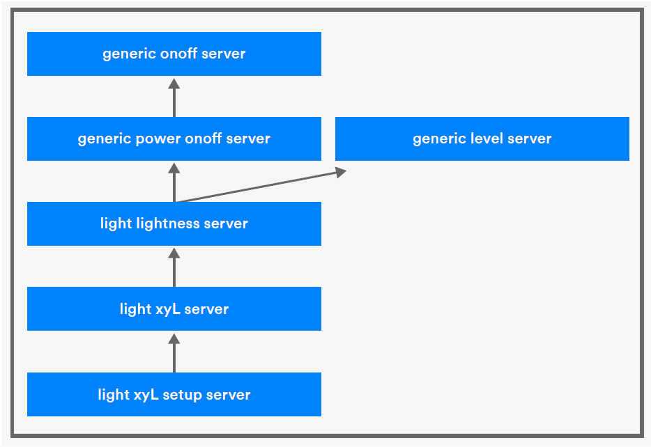

# A Guided Tour of Lighting Models

Lighting can be surprisingly sophisticated and therefore needs specialized Bluetooth mesh models to meet its sometimes complex requirements. The Bluetooth mesh lighting models allow control over the **on/off** state of lights, their **lightness**, **color temperature**, and their **color** \(using various color spaces\). Importantly, they also provide a highly sophisticated software-based lighting controller that can enable smart lighting automation scenarios. As Figure 1 shows, there are 16 lighting models related to 5 distinct aspects of lighting. 

Before beginning the guided tour of the models, consider the nature of lights and the various ways they can be controlled.

## Lighting Overview

### Controlling Lights 

Lights are often controlled manually by pressing buttons, turning knobs, or pushing sliders. But they can also be controlled by sensors, indicating to the lights that there is someone in the room or that the ambient light level has become low because it is getting later in the day or because a cloud has obscured the sun. Lights can be controlled by timers too.

The generic onoff and generic level models detailed in section 4 could be used to control some of the basic attributes of a light, but people perceive lighting conditions in more complex ways, with brightness or lightness perceived according to a non-linear scale. 

Lights have more attributes than their on/off state or their lightness that we might wish to control. Some lights can have their color controlled, and there are a number of ways of modelling color in lights. 

### Smart Lighting

Smart buildings require smart lighting. Smart lighting can be controlled by manual actions taken by building occupants, but, more importantly, a smart lighting system is informed by sensors and uses control algorithms to achieve self-optimizing behaviors that make the system efficient, cost effective, and pleasing to the people that use the building. The Bluetooth mesh lighting models include a particularly special set of models, such as the Light LC models that provide sophisticated, automated control of lights.

## Lighting Concepts 

To appreciate the lighting models, it helps to understand certain concepts from the world of lighting. The key ones are as follows: 

### Color Temperature 

The color temperature of a light source is what leads people to describe colors as either cool or warm. It has a more scientific definition that relates to the temperature of the light radiated by the object, measured in Kelvin. Surprisingly, lower color temperatures are those we describe as warm and higher temperatures as cool. In commercial lighting applications, warmer color temperatures are often used to promote relaxation and cooler temperatures to enhance the concentration of occupants working in the room.

### Color-Tunable Light 

Color-tunable light \(CTL\) is a capability of some lights that allows color temperature to be controlled via two dimensions: lightness and color temperature. 

### Hue 

Colored light has a number of properties, of which hue is one of the main ones. Typically, hue measures the angular position of a color in a color wheel.

### Lightness 

Lightness is the term used to refer to the perception of brightness.

### Saturation 

Saturation is another property of colored light and measures the ratio of an object’s color to its lightness. A given color with a high lightness is said to be less saturated than the same color with low lightness.

### Color Models 

A color model, not to be confused with a Bluetooth mesh model, is a mathematical way of representing colors. There are several color models in popular use, each with its own strengths and weaknesses. 

**HSL** \(hue, saturation, lightness\) represents colors using a cylindrical representation. The angular position in the circular cross section of the cylinder represents the hue, the distance from the center of this circle represents the saturation, and the distance from one end of the cylinder represents the lightness, with one end representing black and the other white.

The **RGB** \(red, green, blue\) color model is an additive model where given levels of red, green, and blue light are mixed to produce a color that people can perceive.

The **CIE1931** color space defines the mathematical relationships between wavelengths of light and perceived colors in vision. Just like RGB and HSL, colors in this model are defined by three values: x, y, and Y. x and y are coordinates of the color on a color chart, and Y measures the luminous intensity. CIE1931 is especially popular in professional lighting applications. 

Each color model has an associated color space that is a set of colors that the model allows to be reproduced.

## The Light Lightness Client, Server, and Setup Models

### At a Glance

These models allow the lightness of a lamp to be controlled by mesh messages and events, such as powering up the device.

### About These Models

Figure 2 depicts the relationships the light lightness server model has with other models. It extends any model depicted with an arrow pointing to it from this model directly or indirectly. It is extended by a model which has an arrow going to the light lightness server.

A number of states are involved in the control of lightness and contained within these models. Understanding these states will provide a good start to understanding the models.

The light lightness state is a composite state, consisting of the light lightness linear, light lightness actual, light lightness last, and light lightness default states.

There are two distinct ways that lightness may be changed using these models. The light lightness linear state provides control along a linear scale, but which people will perceive as non-linear lightness changes. Conversely, the light lightness actual state provides control along a non-linear scale that produces lightness changes perceived by people as being linear.

A range of supported lightness levels, from a minimum level to a maximum level, may be set for the server using its setup model, which contains the light lightness range state, a composite state that includes the light lightness range min state, and the light lightness range max state. The configured range is used in lightness state transitions to ensure only valid, supported values are used by the model.

In addition to states concerned with controlling lightness on a given scale, there are states concerned with restoring the lightness level when the device is switched back on or powered up. These are the light lightness last state and light lightness default state, both of which are involved in the functioning of the generic power onoff server model.

### State Bindings

Light lightness actual and light lightness linear are related by two-way bindings. If one changes then the other must be recalculated.

Light lightness actual is also bound to the generic level, generic onoff, generic onpowerup, and light lightness range states. The precise details of these bindings are defined in the specification, but the general nature of these bindings should be intuitive enough. For example, changing the generic level in a light that has the light lightness server model will change its lightness states as well.

## The LC Client, Server, and Setup Models

### At a Glance

Collectively, the lighting control \(LC\) models form a lighting controller: a software component that allows sophisticated, sensor and user-driven lighting control to be set up. Occupancy and ambient light sensors are catered for so that techniques like daylight harvesting can be employed. As the state of the lighting controller changes, the light lightness state of the light under control progresses through a series of levels, with the transition from one to another governed by configurable timing parameters so that changes are not abrupt and feel natural to building users.

### Decentralized Control

Legacy lighting control requires the installation of dedicated, physical devices, called controllers, sitting in between sensors and lights. This is called a centralized lighting control architecture. See Figure 13.

Bluetooth mesh lighting control is entirely software based and supports a superior, decentralized controller architecture with the controller embedded in the lights rather than in physically separate hardware devices. There are cost advantages and, as described in an article on Bluetooth mesh and scalability, significant performance advantages to this approach. Figure 14 illustrates the Bluetooth mesh decentralized controller architecture.

### Of States and States Machines

The terms controller and lighting controller are used in this paper as an informal shorthand for an element that has the light LC server and light LC setup server models. The aggregate capability given by these models is known as a lighting controller.

The light LC client model is used by elements that are able to configure a light LC setup server model on a remote device. The light LC server is unusual in that it consumes messages from a model that is not part of the same family, namely the sensor server model. This is so that sensors, such as ambient light and occupancy sensors, can provide input to the controller’s operation.

The concept of a finite state machine is important to understanding the way the Light LC models work to form a lighting controller. Indeed, the Bluetooth Mesh Model Specification approaches the definition of lighting control in a different way to that of the other collections of models. A finite state machine for lighting control is presented and much of the specification refers to that state machine. The state machine defined in the specification is an abstraction that defines how the overall lighting controller works. Sitting underneath this are the mesh models and their mesh states, and it is these mesh states that the finite state machine acts upon and is informed by. The use of the word state in these two contexts, that of the overall lighting controller and that of a mesh state data item inside a mesh model, can be a little confusing at first, but it makes perfect sense if you keep the context in mind when reading this section. In this paper, the term mesh state refers to a state that is part of a mesh model, and the term controller state refers to a state that is part of the lighting controller finite state machine.

The following controller states are defined as part of the lighting controller’s finite state machine. Note that this information is a summary of section 6.2.5.1 of the Bluetooth Mesh Model Specification:

| State Machine State | Meaning |
| :--- | :--- |
| Off | The lighting controller is disabled and light lightness is not controlled. |
| Standby | The lighting controller is enabled, but occupancy state changes reported by sensors are ignored. |
| Fade on | Occupancy has been detected, and the lightness level of lights are in the process of transitioning to the level defined in the light LC lightness on mesh state. |
| Run | Lights are now at the lightness level defined by the light LC lightness on mesh state, and lightness stays at this level until a timer expires and causes a transition to the Fade controller state to take place. Occupancy events reset the timer. The controller transitions to and stays in the Run controller state when a room is occupied, and it will stay in that state as long as the room continues to be occupied. |
| Fade | The room is regarded as no longer occupied, so the lightness level starts to transition to the level defined by the light lightness prolong mesh state |
| Prolong | The Prolong controller state can be thought of as an intermediate state, with a corresponding, intermediate lightness level to which lights fade after occupancy has ceased to be detected. On entering the Prolong controller state, a timer is started. When the timer expires, the controller will start to transition into the next controller state. One example that illustrates the purpose of the Prolong controller state is to avoid abruptly plunging an area of an open-plan office into complete darkness when there are still people working at the other end of the office, which is monitored by different occupancy sensors. |
| Fade standby auto | After the Prolong controller state’s timer expires, the controller switches into the fade standby auto state and transitions the lightness level to that defined by the light lightness standby mesh state over some transition period. |
| Fade standby manual | In this state, the controller also transitions the lightness level to the level defined by light lightness standby, but switches into this state in response to a manual event, such as receipt of a mesh message like light LC light onoff set, which switches the lights off. |

Figure 6.7 of the Bluetooth Mesh Model Specification provides a diagrammatic reference to the controller’s finite state machine, showing the set of controller states, the valid transitions between states, and the events that trigger them.

Figure 6.4 from the specification shows an example of the controller states being transitioned through and the effect this has on lightness levels at each stage. It is repeated here in Figure 15 for convenience.

### Transition Times

Each of the four fade states are transitional in that the system is in the process of transitioning to another state. For example, the Fade On controller state is a state the controller will be in whilst transitioning from the Standby controller state to the Run controller state and corresponding lightness level. How long it takes to transition from the current lightness level to the target lightness level, defined for the next state, can be specified in the transition time optional field in relevant mesh messages, or it can be taken from mesh states, such as light LC time fade on. See section 6.2.5.13.1 of the Bluetooth Mesh Models Specification for details of mesh states that define lighting controller state transition times.

### The Details

The LC client, LC server, and LC setup server models form the most sophisticated and, in some ways, complex family of models defined for Bluetooth mesh. They sit at the heart of the support Bluetooth mesh has for advanced commercial lighting systems. This paper has reviewed the concepts governing the operation of these models and how they form a lighting controller, but not looked closely at the underlying mesh states or even the models themselves. There are a significant number of mesh states and properties, some of which allow a lighting controller to be configured to behave in a number of ways. If you are happy with the introduction to the Bluetooth mesh lighting controllers that this section has provided, your next step should be to drill down to the detail provided in the Bluetooth Mesh Model Specification.

## Light CTL Client, Light CTL Server, Light CTL Temperature Server, and Light CTL Setup

### At a Glance

These models allow the control of a tunable, white light source. Tunable white lights offer control over the color temperature of a white light and leverage the most recent research into human biological and cognitive responses to light.

### About These Models

Figure 6 depicts the relationships the light CTL server model has with other models.

Figure 7 shows the simpler light CTL temperature server model that extends the generic level server model only.

Central to the light CTL models is a composite state called the Light CTL state that belongs to the light CTL server model. It consists of the 6 sub-states shown in the table below.

The light CTL temperature server model contains only the light CTL temperature state plus the generic level state due to its extension of the generic level server model. It is simpler than the light CTL server model, but it may not be obvious why the light CTL temperature state appears in both these models. The answer is that color-tunable light can be changed by manipulating two dimensions: lightness and temperature. It was a requirement that each of these be controllable by making changes to the generic level state or, in other words, through a state binding with that state. This implies there must be two distinct instances of the generic level server model to support the two distinct bindings with the generic level state, and the only way to accomplish this is to have two elements in the node’s composition; the first allows light CTL lightness to be modified via the generic level state, and the second allows the light CTL temperature state to be controlled via generic level state changes. The specification designates one element as the main element and the other as the temperature element. Developers must ensure their node composition reflects this dual-element approach when implementing if independent control via level changes is needed for the two dimensions of CTL.

The Light CTL client model provides access to the states in both the light CTL server and light CTL temperature server models and includes support for the usual set, get, and status message types for each state. Check the section 6.6.2 of the specification for details.

### State Bindings

Various state bindings are defined for the states involved in these models, and some of the more interesting ones have been mentioned already. Generic level can be used to control the two dimensions of CTL; power-up events can be used to restore CTL states via bindings with the generic onpowerup state. CTL temperature values are restricted by a binding with the CTL temperature range state, which is involved in various state binding calculations to ensure values do not fall outside the permitted range.

## The Light HSL Client, Server, and Setup Models

### At a Glance

These models provide control over color-changing lights, using the hue/saturation/lightness \(HSL\) model of color representation.

### About These Models

Figure 8 depicts the relationships the light HSL server model has with other models.

The most important Bluetooth mesh state involved in these models is the light HSL state. It is a composite state consisting of substates light HSL hue, light HSL hue default, light HSL saturation, light HSL saturation default, and light HSL lightness.

Light HSL hue represents the hue as a 0-360-degree angle around a color wheel.

Light HSL saturation represents saturation as a 16-bit value with 0x0000 representing the lowest perceived saturation level and 0xFFFF the highest perceived level.

Light HSL lightness measures lightness on a perceptually uniform scale \(see Figure 9\).

These states within the light HSL server model can be controlled by messages from the corresponding client model in the usual way. Additional messages, light HSL target get, and light HSL target status allow all three of light HSL lightness, light HSL hue, and light HSL saturation to be queried and reported on by a single message type. If a transition of any of these states is in progress at the time the status message is to be produced, a remaining time field is included in the message to indicate how long it will be before the transition to the target state has been completed.

### State Bindings

Bindings are defined such that HSL color can be controlled via the generic level of an element and so that the color can be restored to some state when the element is powered up. In addition, there is a relationship between light lightness actual and light HSL lightness, which makes sense given HSL has lightness as one of its dimensions. In brief:

* Light HSL hue is bidirectionally bound to generic level, to generic onpowerup, and to light HSL hue range. 
* Light HSL saturation is bidirectionally bound to generic level, generic onpowerup, and light HSL saturation range.
* Light HSL lightness is bidirectionally bound to light lightness actual.

## The Light xyL Client, Server, and Setup Models

### At a Glance

These models provide control over color changing lights, using the CIE1931 model of color representation.

### About These Models

Figure 10 depicts the relationships the light xyL server model has with other models, and it is similar to the relationship that the light HSL server model has with other models, as shown in Figure 8.

Reviewing the light xyL state reveals much of what you need to know about these models. It is a composite state that consists of states light xyL x, light xyL x default, light xyL y, light xyL y default, and light xyL lightness. These states and the messages provided by the client and server model allow the coordinates of color, according to the CIE1931 color space chart, to be manipulated and defaults to be used when powering up the device to be set.

The light xyL x and light xyL y states represent coordinates in the range 0 to 1 and are transformed to a 16-bit state value by the formulae: 

* $$CIE1931_x = (Light xyL x) / 65535$$ 
*  $$CIE1931_y = (Light xyL y) / 65535$$ 

The special state values 0x0000 and 0xFFFF represent the CIE1931 coordinate values of 0 and 1, respectively.

### State Bindings

Light xyL x is bound to generic onpowerup and light xyL x range. This means the x coordinate can be restored when powering up the device and state binding calculations will keep coordinate values within the valid range for this device. Light xyL y has similar bindings.

Lights may implement the server models for both HSL color control and CIE1931 \(i.e. light HSL server and light xyL server\). When this is the case, indirect state bindings will exist between the light xyL state and the light HSL state. This means that lights can be controlled by clients of either type of model.

