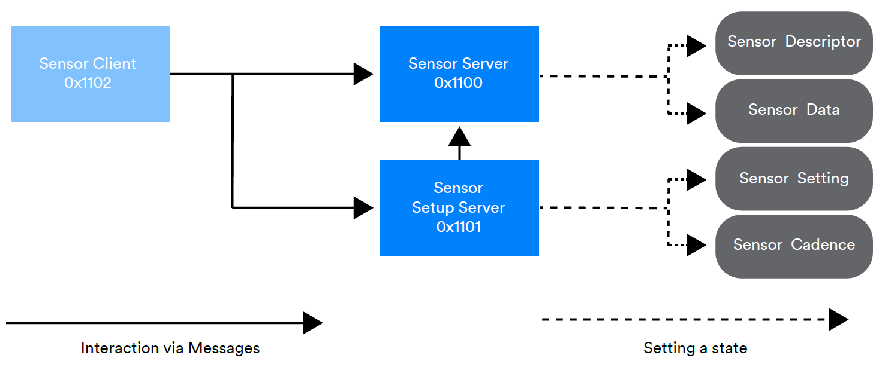
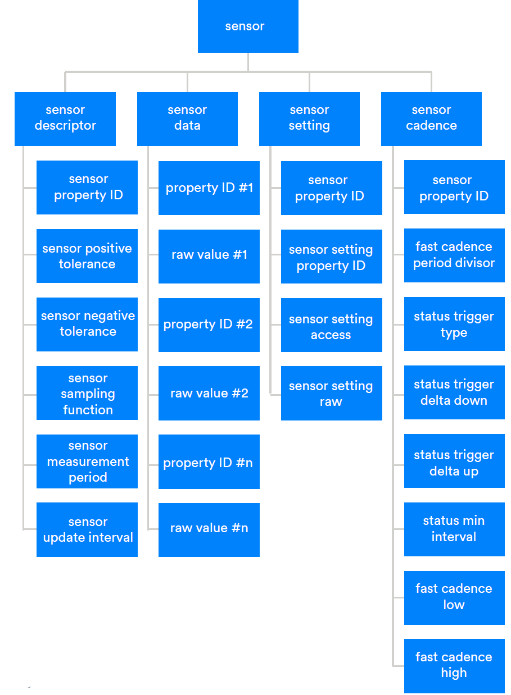

# A Guided Tour of Sensor, Scene, and Time Models

Bluetooth mesh scenes define entire collections of settings for an environment, optimizing it for a particular purpose. For example, you could choose to define a scene that puts a room into the perfect state for a presentation. Switching to a particular scene can be triggered by sensors or a time schedule. 

Sensors play a critical role in many mesh networking applications, including, but not limited to, that of the smart building. They detect and report events like the changing occupancy status of rooms, and they measure attributes of the environment, sharing this data with other devices.

Sensor data can be used to influence or control the operation of one particular type of device, or it can be used to change the state of many devices of many different types, all in one go.

As an example of the first of these cases, the lightness of lights in a room can be dynamically adjusted in response to changing ambient light levels, as reported by ambient light sensors.

As an example of the second case, consider what we might want to happen when a person walks into a previously empty room. We might want the lights to switch on, the heat to be turned up slightly, and the blinds to open. A Bluetooth mesh network makes this scenario possible through the use of scenes. Scenes are collections of memorized model states that are identified by a scene number. Devices can be instructed by a Bluetooth mesh message to switch to the states that belong to a specific scene. This is how mass changes, affecting many different types of devices, can be orchestrated in response to an event like an occupancy change.

Some state changes, including scene switches, can be executed according to a time schedule. A Bluetooth mesh network includes a scheduler that is responsible for this behavior. To work though, nodes must have access to a common, accurate system time. Consequently, there are time models, states, and messages, as well as some special roles nodes may play regarding the propagation of time across the network.

## The Sensor Client, Server, and Setup Models

### At a Glance

These models provide a generalized approach to sensor operation in a Bluetooth mesh network and allow any type of sensor to communicate sensor readings to other nodes in the network. The sensor setup server allows the sensor and format of its data to be configured.

### About These Models

The sensor models make extensive use of properties within a relatively small number of states. 

Properties differ from states in that they contain both an identifier and a value. The identifier tells us what type of data the property contains so that it is self-describing. States, on the other hand, have no explicit type identifier, and it is the model or message the state is contained within that tells us the data’s state. 

Leveraging properties has allowed the three sensor models to accommodate any type of sensor and sensor data, rather than requiring different models, messages, and states for each conceivable type of sensor that might be part of a network.

An element that implements the sensor server model must also have the sensor setup server model, which extends it. The sensor client model is not related to other models and can be used standalone. Figure 1 illustrates the relationship between the three sensor models:

### Sensor State

 The sensor models are defined around a single composite state called the sensor state. This is a fairly complex state whose primary parts are distributed across two models, the sensor server model and the sensor setup server model, as shown in Figure 1.

The complete breakdown of the sensor state is shown in Figure 2.

The sensor data state contains an array of property ID / raw value pairs. The Bluetooth mesh device properties specification defines properties and the characteristics to which they relate. In some cases, a referenced property has a simple value that may be acted upon using sensor model messages, such as sensor get, which return the sensor data state value in a sensor status message. Some properties define arrays of data, suited to creating histograms, and individual columns from within this tabular data can be accessed with messages like sensor column get, which returns a sensor column status message.

The sensor descriptor state contains information that describes the sensor data available from this sensor. It is not expected to change over the entire lifetime of the sensor.

The tolerance fields provide an indication of the magnitude of possible errors in measurements reported by the sensor. The sensor sampling function field indicates the type of function applied to measured sensor values. For example, some sensor data values are instantaneous snap shots of the measured phenomena. Or, perhaps, an averaging function, such as the arithmetic mean, is being applied to measured values and it is this that is contained within the sensor data state. Where a function, such as an averaging function, is being applied, the sensor measurement period field indicates the time period over which measurements are being averaged, and the sensor update interval indicates the frequency with which each measurement is made by the sensor. 

Sensors often have configurable settings, such as sensitivity thresholds. The sensor setting state contains a list of such settings and their values. Each member of the list consists of the ID of the property to which the setting applies, the ID of a property that identifies the setting itself, an indication of whether the setting is read only or may also be written to, and the raw setting value itself. For example, occupancy sensors often have motion-sensitivity settings that allow the sensor to be configured so that false alarms, triggered perhaps by small furry animals, are not created. Property 0x0043 Motion Threshold allows the configuration of the required sensitivity level in this case.

The sensor cadence state allows the frequency with which a sensor publishes status reports relating to each sensor data type \(identified by property ID\) to be configured. The rate of publication can be configured to vary according to various conditions. When the value falls within a configured range, the publication rate can be increased. If particularly large increases or decreases in the sensor data value are measured, the reporting rate can also be increased. In each case, the fast cadence period divisor indicates by how much the rate of publication should be increased when any of these circumstances arise.

### Sensors and Other Models

The light LC server model can consume sensor status messages. This allows sensors, such as ambient light sensors and occupancy sensors, to be used with important lighting control scenarios. The lighting models are explored in a previous section of this paper.

## Time, Scenes, and Scheduling

### At a Glance

Bluetooth mesh scenes allow collections of devices of various types to be instructed to load specific settings simultaneously. This allows changes that affect many types of devices to be orchestrated all in one action. Scene selection can be triggered by a Bluetooth mesh message or via a time schedule. In support of scheduled operations, Bluetooth mesh makes it possible for an accurate system time to be propagated to nodes across the network.

### Scenes and Scene Registers

A scene is a uniquely numbered list of states with associated state values that is split up and distributed across a number of elements within nodes in the network. Each element that uses scenes has a scene register, which is a state contained within the scene server model. The scene register is a table with each row identified by a scene number. Each row in the table also contains an object that acts as a container for all of the states and values that need to be memorized as part of that scene. The specific structural details for this container object are not specified and are left to the implementor.

The aggregate of all rows with the same scene number from all nodes in the network is a unique scene.

Example scene registers for elements within two types of node are shown below.

| scene number | state container |
| :--- | :--- |
| 10 | generic onoff=0,light lightness actual=0,light HSL hue=0x42f4f4 |
| Standby13 | generic onoff=1,light lightness actual =65535,light HSL hue=0x42f4f4 |

| scene number | state container |
| :--- | :--- |
| 10 | generic level=100 |
| Standby13 | generic level=0 |

The scene models define messages that the scene client model can publish to store, recall, or delete scenes from within receiving elements’ scene registers.

In an example building and network, the requirement might be that when a room is occupied, lights are switched on and set to a given lightness level and hue, and the blinds are opened. An occupancy sensor could publish a scene recall message which specifies that scene 13 be activated when the room becomes occupied, and similarly, publish a scene recall message, activating scene 10 when the room becomes unoccupied. The example scene register in Figures 24 and 25 should illustrate how, in the first case, scene 13 would switch the lights on, set their lightness to full brightness, their color to a subtle blue color, and cause the blinds to open \(level 0\). In the second case, switching everything to scene 10 results in the lights being switched off and the blinds closing \(level 100\). All of these changes happen simultaneously in response to the scene client model in the sensor publishing a single scene recall message.

A Bluetooth mesh network can have up to 65,535 distinct scenes defined for it. Individual elements can store state values for up to 16 distinct scenes in their scene register, which should be more than enough for any type of device.

### Time and Time Propagation

Times in a Bluetooth mesh network are based on the International Atomic Time \(TAI\) standard. Three models, the time client, time server, and time setup server are defined. When the time server model is present in an element, the time setup server model must also be present, per the usual usage pattern.

The time server model contains a single state called time. It contains a TAI time, information about uncertainty, and the degree to which the time can be trusted, plus information about time zone offsets. The time setup server adds a further state called time role. Time roles define whether or not an element participates in the propagation of time state values across the network and, if so, how. Four distinct roles are defined and represented by the time role state. They are listed in Table 5.2 of the Bluetooth Mesh Model Specification, which is repeated here for convenience:

| Value | Role | Description |
| :--- | :--- | :--- |
| 0x00 | None  | The element does not participate in propagation of time information. |
| 0x01 | Mesh Time Authority | The element publishes Time Status messages but does not process received Time Status messages. |
| 0x02 | Mesh Time Relay  | The element processes received and published Time Status messages. |
| 0x03 | Mesh Time Client  | The element does not publish but processes received Time Status messages. |
| 0x04-0xFF | Prohibited |  |

The time setup server model defines messages that allow time role to be maintained in an element.

Time server models respond to messages relating to their time state in the usual way. But to propagate messages across the network, time servers with the mesh time authority role publish the time periodically in accordance with the publish period state, which is part of the configuration server model. Elements with the role mesh time relay also publish unsolicited time status messages, but they do so only when one is received from a mesh time authority. Mesh time clients are end points in the time propagation process, receiving and storing time data from time status messages, but not publishing or relaying them. It is in this way that time is distributed across the network.

### Scheduling

Certain types of state changes can be scheduled to take place at a specific time every day, on a specific day of the week. This is made possible by a set of models, the scheduler server, scheduler setup server, and the scheduler client. The scheduler server extends the scene server model, and the scheduler client model extends the scene server model so the ability to schedule actions that change state is dependent on the scene models being implemented.

The scheduler server model contains a tabular state called the scheduler register. This state allows up to 16 sets of scheduling data to be stored, each consisting of scheduling time and frequency information, an action to take, and a scene number \(optional\). It therefore allows up to 16 state changing actions to be scheduled. Actions allowed switch the element on, switch it off, or recall the specified scene. The scheduler offers a great deal of flexibility in how actions are scheduled, and every action can have an associated transition time specified for it as well.

