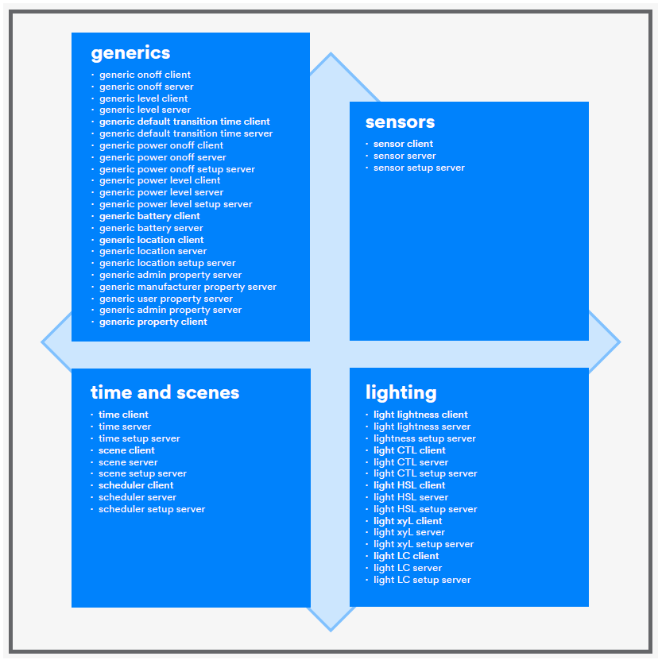

# Overview of Mesh Models

The standard Bluetooth SIG models are defined in a dedicated specification called the Bluetooth Mesh Model Specification. In this specification, you will find extensive and rigorous information on each of the **52 standard mesh models**.

What can we learn about mesh models from Figure 1? First, there are four groups of models: the **generics**, models for **sensors**, models for **lighting**, and models concerned with **time and a mesh automation feature called the scene**. If you review the lists in Figure 1, you will also find that **every client model has a corresponding server model** and vice versa and that **some server models have a corresponding setup server model** too.

Generally, models are optional. Developers implement those models that equip their products with the mesh capabilities they need. **But there are two models whose inclusion is mandatory** and, collectively, these models are the heading of the foundation models.

