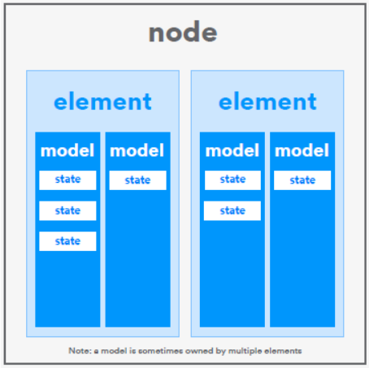

# What is a Mesh Model?

A Model defines a set of **States**, **State Transitions**, **State Bindings**, **Messages** and other associated **behaviors**. An Element within a Node must support one or more models and it is the model or models that define the functionality that an Element has. There are a number of models that are defined by the Bluetooth SIG and many of them are deliberately positioned as “generic” models, having potential utility within a wide range of device types.

Essentially, models are specifications for standard software components that, when included in a product, determine what it can do as a mesh device. Models are self-contained components and products will incorporate several of them. Collectively, from a network’s point of view, models make the device what it is.

## State

Models contain **states**. States are data items that indicate the condition of the device, such as on/off or high/low. States may be simple, containing only a single value, or composite, containing multiple fields, similar to a struct in programming languages like C. 

In some cases, there are relationships defined between state items. These relationships are called **state bindings**. A state binding indicates that if one of the states in the relationship changes, then the other one needs to have its value recalculated. Sometimes state bindings are conditional and may be enabled or disabled by some other state. **Developers must implement the required logic for any state bindings that are defined for the models they are using and ensure that logic is executed whenever required.** 

Conversely, **where state bindings are not explicitly defined in the Bluetooth Mesh Model Specification, states must act independently.** For example, if the generic on/off state indicates that a device is currently off, increasing the generic level state should have no user-discernible effect. Switching the device on by setting the generic on/off state to 1 should not only switch the device on, but it should begin functioning at the level that has been set. This can be readily understood if you consider a rotary dimmer switch that is rotated to change the level of the lights in the room but can also be pressed to switch them on or off. You can rotate the control when the lights are off and nothing will appear to happen, but if you then press the switch, with it in the same rotated position, the lights will come on at the selected level of brightness.

## Categories of Model 

**Models are classified as being either clients**, which do not contain state, **or servers**, which do. State is the term used for a data item which represents the condition that some aspect of a device is in, such as whether it is on or off or what level it is turned up to. 

**Some server models are associated with another server model with a name that is similar but includes “SetUp” in it.** For example, the Sensor Server model has an associated Sensor Setup Server model. SetUp server models are technically no different to other server models in that they contain a state and produce and consume particular types of messages. **Their purpose is to allow the separation of a model’s configuration settings from the main model state items so that distinct access control policies can be applied. It is common to allow a network administrator to configure a model’s associated settings via its SetUp Server model but not allow standard users to do this.**

## Model Communication and Behaviors 

**Models talk to each other by sending and receiving messages.** **There are numerous types of message, and these are defined as part of the specification for each model** so that it is clear what types of message a model can produce and what types of message it can receive and understand. 

Messages either communicate a state value to other devices or they change a state value, eliciting a response, often visible, from a device. 

Models defined by the Bluetooth Special Interest Group \(SIG\) in the Bluetooth Mesh Model Specification are known as **Bluetooth SIG models**. Vendors may define their own models too, and these are known as **vendor models**. Vendor models should be used with caution and only when there is no possible way to use Bluetooth SIG models to meet the requirements. 

**Models can have specified dependencies on other models.** A model may extend another model, a process whereby the first model adds states to the second model. A model may also require that a model which extends it be present. Models that do not extend other models are known as root models.

## Software Developers and Bluetooth Mesh Models 

### Object Orientation 

**Software developers should find it easy to imagine model specifications as being akin to classes in the object-oriented \(OO\) software engineering paradigm and model implementations in code inside a device as an instance of the model or object.** The Bluetooth mesh specifications do not stipulate any particular approach to implementing models in code; that’s left to the developer and the programming language and APIs in use. But models do lend themselves to an object-oriented approach, and the specification even talks about one model extending another, a concept that is also reminiscent of OO. 

### SDK Variations 

There are a number of SDKs \(software developer kit\) for developing mesh firmware. Some are from Bluetooth module vendors that are specific to creating code for their modules. Others, such as the **Zephyr RTOS SDK, are hardware agnostic and allow for the creation of firmware for numerous different target boards.** At this time, Zephyr supports 100 different target boards. Whatever SDK you use, the principals involved in implementing mesh firmware will be the same. In this paper, code created with the Zephyr SDK will be presented as a way of illustrating points from a developer’s point of view.

### Node Composition 

**One of the first key tasks a mesh firmware developer must undertake is to define their product’s mesh node composition.** This means defining in code how many elements the node has and what models each of the elements contains. Figure 1 shows the relationships between the node, its elements, the models contained within elements, and the items of state that each model contains. 



Details will vary across SDKs, but using the Zephyr SDK node composition involves creating a series of arrays, each of which contains structs defined by macros that the SDK provides. It might look something like the example above that shows four models belonging to an element, which is the sole element of the node. 

```text
// models - an array of specific model definitions
static struct bt _ mesh _ model sig _ models[] = {
BT _ MESH _ MODEL _ CFG _ SRV(&cfg _ srv),
BT _ MESH _ MODEL _ CFG _ CLI(&cfg _ cli),
BT _ MESH _ MODEL _ HEALTH _ SRV(&health _ srv, &health _ pub),
BT _ MESH _ MODEL(BT _ MESH _ MODEL _ ID _ GEN _ ONOFF _ SRV,
generic _ onoff _ op,
&generic_onoff_pub, NULL),
BT _ MESH _ MODEL(BT _ MESH _ MODEL _ ID _ GEN _ LEVEL _ SRV,
generic _ level _ op,
&generic_level_pub, NULL)};
// elements - contains arrays of SIG models and vendor models (none in
this case)
static struct bt _ mesh _ elem elements[] = {
BT _ MESH _ ELEM(0, sig _ models, BT _ MESH _ MODEL _ NONE),
};
// node composition - contains an array of elements
static const struct bt _ mesh _ comp comp = {
.elem = elements,
.elem _ count = ARRAY _ SIZE(elements),
};
```

### Properties

There are two forms that data items can take in a Bluetooth mesh model. 

* **State** values are members of particular models and have a value with a meaning that the specification defines. They are not self-describing, and the state a message relates to is inferred from the opcode of the message. 
* **Properties**, on the other hand, **are instances of characteristics to be interpreted in a given context. Characteristics are also used with GATT.** A characteristic defines the fields its value consists of, such as permissible values and their meaning and, in the case of GATT, includes an explicit type identifier in the form of a UUID \(universally unique identifier\). When used in GATT, characteristics are members of services, and the service that owns a characteristic provides a context within which to interpret and work with the characteristic. For example, the Alert Level characteristic can be a member of either the Link Loss service or the Immediate Alert service. The meaning of the characteristic varies depending on which service it is a member of, and this is defined in the GATT service specification.

Bluetooth mesh does not use GATT services. Instead, properties provide context for interpreting a related characteristic.

> “The Temperature 8 Characteristic is a type which represents a temperature measurement, has a format of uint8, and uses units of 0.5 degrees Celsius. Several properties are defined for this characteristic, thus allowing it to be interpreted in various contexts. The Present Indoor Ambient Temperature property indicates that the Temperature 8 characteristic should be interpreted as being a measurement which was taken indoors, whereas the Present Outdoor Ambient Temperature property relates to measurements taken outdoors, and the Present Ambient Temperature property is not specific about the type of location, and this is left to be derived from other location properties.”

> “温度8特性是代表温度测量的类型，格式为uint8，单位为0.5摄氏度。 为此特性定义了几个属性，因此可以在各种情况下对其进行解释。 当前室内环境温度属性表示应该将温度8特性解释为在室内进行的测量，而当前室外环境温度属性与在室外进行的测量有关，并且当前环境温度属性并不具体针对温度类型。 位置，则可以从其他位置属性中导出。”

**Properties are explicitly identified by a Property ID.** In a model where a property is in use, the property ID and property value comprise the value of a state. For example, **the sensor data state contains one or more pairs of property ID and a corresponding sensor value.** 

Properties allow the same model to be used with a wide range of data types, which, in the case of models like the sensor server model, is hugely advantageous since any type of sensor data can be handled and interpreted with respect to any context, provided a suitable property has been defined. Without this approach to describing and encapsulating data, many different types of sensor models would be required, or the sensor server model would need to have a large number of states for each of the different types of sensor data it might need to support. 

### Client and Server Decoupling 

When implementing models, it is important to respect the fact that client models and server models must know nothing about each other’s implementation details. For example, a server should not need to know or choose to exploit knowledge of the specific values that a client might be able to send. Each is a black box to the other. 

### Coding Models 

Apart from specifying which models belong to each element in node composition, what else do developers need to do to incorporate the models that have been selected for their product? In some cases, nothing at all. Some models like the health server model are mandatory \(in the primary element of a node, which all nodes have\), and the SDK may provide a complete implementation, which is easily incorporated in the node’s composition.

1. RX Message Handler Functions

   The opcodes of messages associated with each model and which the node might receive \(RX\) must

   be registered and, one or more functions for handling those message types, implemented. Here’s

   what that looks like in Zephyr code above.

   Messages received by a model either change a state value \(set\) or request that the current value of a

   particular state be reported in a status message \(get\). Set messages come in two forms: those that do not require a response \(unacknowledged\) and those that require the new state value to be sent back in a status message. The term set is sometimes used to mean either of these two variations.

   When handling state changes produced by set messages, developers must ensure that any defined and active state bindings are processed, recalculating other dependent state values as required.

2. TX Message Producer Functions

   Models almost certainly need to transmit \(TX\) messages as well as receive them. Functions that

   formulate mesh messages and use the appropriate API to send messages need to be written and their execution triggered by suitable events or device interactions, such as the user pressing buttons or turning knobs. Developers will be largely concerned with the access layer part of messages rather

   than those fields that are related to lower layers of the stack, though there can be exceptions. It may

   be necessary to explicitly increment the SEQ field to avoid having devices reject messages as forming part of a suspected replay attack, or the software framework may do this automatically.

3. Bind Application Keys to Models

   **All mesh messages are encrypted and authenticated using AES-CCM.** Header fields are also

   obfuscated to make network-pattern-analysis attacks difficult. Fields from upper layers of the stack

   are encrypted using an application key, and fields from lower in the stack are encrypted using a

   network key. This separates network and application security and allows nodes to perform network

   functions, such as the relaying of messages without needing or having the ability to decrypt the

   application payload of the message.

A good mesh software framework automatically secures messages through encryption and obfuscation, using the network and application keys established when the device was provisioned. But a node may have several application keys, and each must be associated with specific models through a process known as key binding. This ensures that the stack knows which application key to use with which types of message. Developers will almost certainly need to perform explicit application key binding in their code.

net\_idx and app\_idx are index values that reference specific keys from the list of one or more network and application keys that a node might have been equipped with when initially provisioned and configured. 

**Application key binding is the basis for access control in a Bluetooth mesh network.** Issuing the network administrator with the application key bound to the sensor setup server model gives that user the ability to update that model’s state and configure the associated sensor server model. Other users, not in possession of this application key, cannot configure the sensor setup server.

