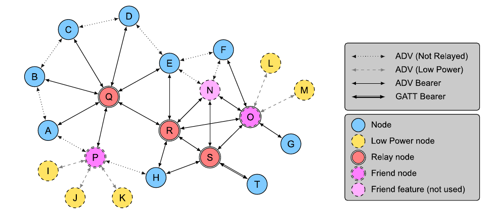

# Architectural concepts

## States

**A state is a value representing a condition of an element.** 

An element **exposing** a state is referred to as a **server**. For example, the simplest server is a Generic OnOff Server, representing that it is either on or off. 

An element **accessing** a state is referred to as a **client**. For example, the simplest client is a Generic OnOff Client \(a binary switch\) that is able to control a Generic OnOff Server via messages defined by the Generic OnOff Model. 

States that are composed of two of more values are known as **composite states**. For example, a color- changing lamp can control color hue separately from color saturation and brightness.

## Bound states 

**When a state is bound to another state, a change in one results in a change in the other.** Bound states may be from different models in one or more elements. For example, a common type of binding is between a Level state and an OnOff state: changing the Level to 0 changes the bound OnOff state to Off and changing the Level to a non-zero value changes the bound OnOff state to On.

## Messages 

**All communication within a mesh network is accomplished by sending messages.** **Messages operate on states.** For each state, there is a defined set of messages that a server supports and a client may use to request a value of a state or to change a state. A server may also transmit unsolicited messages carrying information about states and/or changing states.

**A message is defined as having an opcode, associated parameters, and behavior.** An opcode may be a single octet \(for special messages that require maximum possible payload for parameters\), 2 octets \(for standard messages\), or 3 octets \(for vendor-specific messages\). 

A total message size, including an opcode, is determined by the underlying transport layer, which may use a **Segmentation and Reassembly** \(SAR\) mechanism. To maximize performance and avoid the overhead of SAR, a design goal is to fit messages in a single segment. **The transport layer provides up to 11 octets for a non-segmented message**, leaving up to 10 octets that are available for parameters when using a 1-octet opcode, up to 9 octets available for parameters when using a 2-octet opcode, and up to 8 octets available for parameters when using a vendor-specific 3-octet opcode. 

**The transport layer provides a mechanism of SAR capable of transporting up to 32 segments.** **The maximum message size when using the SAR is 384 octets**. This means \(excluding an Application MIC\) up to 379 octets are available for parameters when using a 1-octet opcode, up to 378 octets are available for parameters when using a 2-octet opcode, and up to 377 octets are available for parameters when using a vendor-specific 3-octet opcode. 

**SAR effectively does not impose any extra overhead on the access layer payload per segment:** a 10-octet message is transported as an unsegmented message, and a 20-octet message is transported as a segmented message that uses two segments. 

Message definitions contain tables of parameters. In a message payload, parameters follow an opcode, and parameter offsets are in octets unless otherwise specified.

**Messages are defined as acknowledged or unacknowledged.** An acknowledged message requires a response whereas an unacknowledged message does not require a response.

## Elements

**An element is an addressable entity within a node.** Each node has at least one element, the **primary element**, and may have one or more additional **secondary elements**. The number and structure of elements is static and **does not change** throughout the lifetime of a node \(that is, as long as the node is part of a network\). 

The **primary element** is addressed using the **first unicast address** assigned to the node during provisioning. Each additional **secondary element** is addressed using the **subsequent addresses**. These unicast element addresses allow nodes to identify which element within a node is transmitting or receiving a message.

If the number and structure of elements **changes**, for example due to a firmware update, the node must be **reprovisioned**. The **Node Removal procedure** is used when a firmware update is performed that **changes the number or structure of elements**.

**Messages are dispatched within models based on opcodes and element addresses.**

**An element is not allowed to contain multiple instances of models that use the same message in the same way** \(for example, receive an “On” message\). When multiple models within the same element use the same message, the models are said to “overlap.” To implement multiple instances of overlapping models within a single node \(for example, to control multiple light fixtures that can be turned on and off\), **the node is required to contain multiple elements.**

For example, a light fixture may have two lamps, each implementing an instance of the Light Lightness Server model and an instance of the Generic Power OnOff Server model. This requires that the node contain two elements, one for each lamp. When it receives an "On" message, the node uses the unicast address of the element to identify which instance of the Generic Power OnOff Server model the message is addressed to. 

In another example, a dual-socket power strip contains two independent energy measurement sensors that can measure power consumed by an appliance connected to a socket. **This would require that the node have two Sensor Data states, each in a separate element**. The first element, the primary element, would be identified using the unicast address for the node and would include a state for the first energy sensor as well as states representing the configuration of the node. The second element, a secondary element, would be identified using a unicast element address and would include the state for the second energy sensor. 

**Each element has a GATT Bluetooth Namespace Descriptor value** that helps identify which part of the node this element represents. These namespace descriptor values use the same definitions as GATT. For example, the elements of the temperature sensor would use the values “inside” and “outside.”

## Addresses

**An address may be a unicast address, a virtual address, or a group address**. **There is also a special value to represent an unassigned address that is not used in messages.** 

**A unicast address** is allocated to an element and always represents a single element of a node. There are **32767** unicast addresses per mesh network. 

**A virtual address is a multicast address** and can represent multiple elements on one or more nodes. **Each virtual address logically represents a Label UUID**, which is a 128-bit value that does not have to be managed centrally. Each message sent to a Label UUID includes the full Label UUID in the message integrity check value that is used to authenticate the message. To reduce the overhead of checking every known Label UUID, a hash of the Label UUID is used. **There are 16384 hash values, each of which codifies a set of virtual addresses. While there are only 16384 hash values used in a virtual address, each hash value can represent millions of possible Label UUIDs;** therefore, the number of virtual addresses is considered very large. 

**A group address is a multicast address** and can represent multiple elements on one or more nodes. There are **16384** group addresses per mesh network. There are a set of fixed group addresses that are used to address a subset of all primary elements of nodes based on the functionality of those nodes. All other group addresses are known as dynamically assigned group addresses. **There are 256 fixed group addresses and 16128 dynamically assigned group addresses.**

## Models 

**A model defines the basic functionality of a node**. A node may include multiple models. A model defines the required states, the messages that act upon those states, and any associated behavior.

**A mesh application is specified using a client-server architecture communicating with a publish-subscribe paradigm.** Due to the nature of mesh networks and the recognition that the configuration of behavior is ****performed by a Configuration Client, an application is not defined in a single end-to-end specification such as a profile. Instead, an application is defined in a client model, a server model, and a control model. 

This specification defines three types of model: server models, client models, and control models: 

* **Server model**: A server model is composed of one or more states spanning one or more elements. The server model defines a set of mandatory messages that it can transmit or receive, the behavior required of the element when it transmits and receives such messages, and any additional behavior that occurs after messages are transmitted or received. 
* **Client model**: A client model defines a set of messages \(both mandatory and optional\) that a client uses to request, change, or consume corresponding server states, as defined by a server model. The client model does not have state. 
* **Control model**: A control model may contain client model functionality to communicate with other server models and server model functionality to communicate with other client models. A control model may also contain control logic, which is a set of rules and behaviors that coordinate the interactions between other models that the control model connects to.

## Publish-subscribe and message exchange

**Publication and subscription of data within the mesh network is described as using a publish-subscribe paradigm.** Nodes that generate messages publish the messages to a unicast address, group address, or virtual address. Nodes that are interested in receiving the messages will subscribe to these addresses. 

Generated messages are sent to destination mesh addresses that can be unicast, pre-configured group addresses, or virtual addresses. Messages can be sent as replies to other messages or can be unsolicited messages. When an instance of a model is sending a reply message, it uses the incoming message originator’s source address as the destination address. When an instance of a model is sending unsolicited messages, it uses a model publish address as the destination address. Each instance of a model within a node has a single publish address. 

On the receiving side, each instance of a model within a node can subscribe to one or more group addresses or virtual addresses. Whenever a message that is addressed to a group address or a virtual address on one of the model’s subscription lists arrives, it is processed by the node. A message is also processed when its destination address is the unicast address of a receiving element or when its destination address is a fixed group address that this device is a member of. If a node has multiple elements, then the message is processed once on each of the addressed elements. 

Publish addresses and subscription lists for models defined by higher layer specifications use the Model Publication and Subscription List states that are managed by the Configuration Server Model. 

A node can have multiple subscriptions per instance of a model’s element, although nodes may limit the number of subscriptions that are supported. Using multiple subscription addresses allows a node to respond to messages that are published to different groups. For example, a light may be subscribed to messages sent to the bedside light group, the bedroom group, the upstairs group, and the house group. 

Each message is sent from a single unicast address \(an element address\) and sequenced using a unique sequence number to facilitate detection of and protection against replay attacks.

## Security 

All messages are encrypted and authenticated using two types of keys. One key type is for the network layer communication, such that all communication within a mesh network would use the same network key. The other key type is for application data. Separating the keys for networking and applications allows sensitive access messages \(e.g., for access control to a building\) to be separated from non-sensitive access messages \(e.g., for lighting\). There are no unencrypted or unauthenticated messages within a mesh network.

### Application and network security 

Encrypting and authenticating messages at the upper transport layer and network layer is designed to secure communications within the mesh network against eavesdroppers and malicious attacks. Each layer maintains distinct keys to allow separation between application and network entities. 

Splitting application keys from network keys enables secure relay transmission of application messages: Relay nodes can authenticate messages at network level without accessing the application data. For example, a light bulb acting as a Relay node should not be able to unlock doors. 

This means that nodes can relay access messages using keys derived from the network key without having to know the application key; therefore they would not have the ability to change or understand the application data. It is expected that network keys would be widely known by many nodes within a network, thereby increasing the density of Relay nodes while protecting the different application areas from each other. This requires separate keys for each application. For example, the sensitive door security application would be separated from the non-sensitive doorbell and lighting application. 

The application key is used directly along with an associated application key identifier that is used in certain contexts to identify the application used. However, the network key is always used through a key derivation function to generate other keys that are used directly. Examples of such keys include encryption and privacy keys. This allows a single network key to be changed and all the associated values that are derived from that key to be quickly derived. As with the application key, the network key is also used to derive a network key identifier.

The security model defines three separate keys \(the device key \(DevKey\), the application key \(AppKey\), and the network key \(NetKey\)\) to secure the messages. When a node is given a key, it is authorized to use that key. A key that is shared between multiple nodes enables any node with that key to transmit and receive messages using that key. 

The device key facilitates confidentiality and authentication of key material between a Configuration Client and a single node. The application key facilitates confidentiality and authentication of application data sent between intended nodes. The network key facilitates privacy, confidentiality, and authenticity of network messages. A node may have knowledge of a single device key, multiple application keys, and multiple network keys. 

A device key is similar to an application key in that it is designed to secure information sent by an application in the upper transport layer. However, a device key is only known by a Configuration Client and the single node. The Configuration Client knows the device keys for all nodes, which allows the Configuration Client to securely distribute keys to a set of nodes by sending these keys secured with the device key for each individual node, allowing a key distribution to be targeted at only those nodes that need to know. Use of a device key is designed to protect against the “trash-can” attack \(a technique to retrieve information from a disposed device that can be used to carry out an attack on a network\) by allowing the distribution of new network and application keys to selected devices only. 

An application key can only be used with a single network key. This implies that a network key has one or more application keys associated with it. This association is known as the key binding. 

The granularity of access layer security is on a per-model basis. Each server model has a set of application keys bound to it, defining the possible keys that should be used to encrypt and authenticate a message to be processed by the model. This allows multiple entities to operate certain node functions. Up to 251 application keys can be bound to a model. For example, a Light Lightness Server Model has three keys bound to it because the admin, user, and guest can all switch on a light. However, only the admin can configure the lamp, so the Configuration Server Model has only the admin application key bound to it.

## Obfuscation 

The network security model utilizes a privacy mechanism called obfuscation that utilizes AES to encrypt the source address, sequence numbers, and other header information using a privacy key. The intent for obfuscation is to make tracking nodes more difficult.

Network and application key identifiers 

A node may have multiple network or application keys. 

By using a key identifier, it is possible to identify which subset of keys are used to secure the message. For example, instead of checking 20 keys, a node may only need to check two keys that have the same least significant bits of the key identifier. If a message is received with a key identifier that is not known, then the node can immediately discard it. 

The key identifier is generated from the network or application key using a key derivation function.

This specification defines a separate identifier for the network key and application key. A network key identifier is transmitted in each Network PDU using a 7-bit value, while the application key identifier is transmitted in each Lower Transport PDU using a 6-bit value.

### Initialization vector index 

A Network PDU contains a 24-bit sequence number that allows an element to transmit 16,777,216 Network PDUs. The sequence number is used in the security nonce to provide uniqueness; therefore the sequence number must not wrap. If an element is transmitting a new message at 2 Hz, then these sequence numbers would be exhausted after 97 days. To enable a mesh network to operate for longer periods of time than the sequence number space allows, an additional 4-octet value called the IV Index is defined that is included in the security nonce. For example, using the same 2 Hz message frequency would measure the lifetime of the network using the IV Index in billions of years. 

To enable a gradual transition from one IV Index to the next, each Network PDU includes the least significant bit of the IV Index that was used to transmit the message. A node can also use an IV Update procedure to signal to peer nodes that it is updating the IV Index. This procedure takes a minimum of eight days to transition from the old IV Index to the new IV Index, thereby limiting the frequency that a node can transmit messages to 24 Hz. However, a node should not send more than 100 Network PDUs in any 10 second window, so this would typically take approximately 19 days to exhaust.

## Friendship 

Friendship is used by Low Power nodes to limit the amount of time that they need to listen. If a node cannot receive continuously, then it is possible that it will not receive mesh messages that it should be processing. This includes security updates required for maintaining the security of the network as well as the normal mesh messages. 

If the Low Power node does not receive such messages, then it may not operate as desired and it may also fail to keep up-to-date with the latest security state of the network and eventually drop off the network if this security is changed without its knowledge. 

Friendship is a special relationship between a Low Power node and one neighboring Friend node. These nodes must be within a single hop of each other and in the same subnet. 

Friendship is first established and initiated by the Low Power node; once established, the Friend node performs a number of actions that help reduce the power consumption on the Low Power node. The Friend node maintains a Friend Queue for the Low Power node, which stores all incoming messages addressed to the Low Power node. The Friend node delivers those messages to the Low Power node when requested by the Low Power node. Also, the Friend node delivers security updates to the Low Power node. 

When friendship is established between a Low Power node and one Friend node, the two nodes are considered to be “friends”. 

A Friend node may be friends with multiple Low Power nodes. A Low Power node can only be friends with a single Friend node.

## Features 

The functionality of nodes is determined by the features that they support. All nodes have the ability to transmit and receive mesh messages. Nodes can also optionally support one or more additional features: 

* **Relay feature** – the ability to receive and retransmit mesh messages over the advertising bearer to enable larger networks. 
* **Proxy feature** – the ability to receive and retransmit mesh messages between GATT and advertising bearers. 
* **Low Power feature** – the ability to operate within a mesh network at significantly reduced receiver duty cycles only in conjunction with a node supporting the Friend feature. 
* **Friend feature** – the ability to help a node supporting the Low Power feature to operate by storing messages destined for those nodes. 

A node that supports a feature may have that feature enabled or disabled, and the feature, when enabled, may be or may not be in use. 

A node supporting the Relay feature may have this feature disabled, but it would still support the Relay feature, it is just that it is not performing the functionality required by that feature. A node that supports the Relay feature and has the Relay feature enabled is known as a Relay node. 

A node supporting the Proxy feature may have this feature disabled, but it would still support the Proxy feature, it is just that it is not performing the functionality required by that feature. A node that supports the Proxy feature and has the Proxy feature enabled is known as a Proxy node. 

A node supporting the Low Power feature cannot have this feature disabled and must establish a friendship with another node supporting the Friend feature before it can use the Low Power feature to reduce receiver duty cycles. A node that supports the Low Power feature and has a friendship with a node that supports the Friend feature is known as a Low Power node. 

A node supporting the Friend feature may have this feature disabled, but it would still support the Friend feature, it is just that it is not performing the functionality required by that feature. A node that supports the Friend feature, has the Friend feature enabled, and has a friendship with a node that supports the Low Power feature is known as a Friend node.

## Topology

Nodes that support the various features described above can be formed into a mesh network.

Figure shows three Relay nodes: Q, R, and S. The three nodes that support the Friend feature are N, O, and P, however N does not have any friendships; therefore only O and P are Friend nodes. There are five Low Power nodes: I, J, K, L, and M. Nodes I, J, and K have P as their friend, while L and M have O as their friend. Node T is only connected to the mesh network using a GATT bearer; therefore S must relay all messages to and from T. 

For example, if a message is to be sent from T to L, then T will send the message to node S using the GATT bearer. Node S will retransmit this message using the advertising bearer. Nodes H, R, N, and O are within radio range of node S; therefore they will receive this message. Node O, being the friend of node L will store the message, and if the message was a segmented message, node O will respond with an acknowledgment at the lower transport layer. Sometime later, L will poll node O to check for new messages, such that O will forward the message originally sent by T to L.

## Mesh gateway 

A mesh gateway is a node that is able to translate messages between the mesh network and a non- Bluetooth technology. A node may be able to send and receive mesh messages through a mesh gateway while not in the range of any of the Relay nodes. This translation is out of scope for this specification. 

## Concurrency limitations and restrictions 

There are no concurrency limitations or restrictions for nodes imposed by this specification. 

## Topology limitations and restrictions 

There are no topology limitations or restrictions imposed by this specification when used with the Bluetooth low energy transport.

