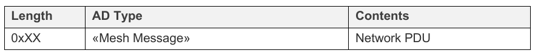

# Mesh networking

## Bearers

This specification defines two mesh bearers over which mesh messages may be transported:

* An advertising bearer 
* A GATT bearer

### Advertising bearer

When using the advertising bearer, a mesh packet shall be sent in the Advertising Data of a Bluetooth Low Energy advertising PDU using the Mesh Message AD Type identified by «Mesh Message» as defined [Bluetooth SIG Assigned Numbers](http://www.bluetooth.com/specifications/assigned-numbers).

The Mesh Message AD Type contains a Network PDU as defined in Table 1.1.

Any advertisement using the Mesh Message AD Type shall be **non-connectable and non-scannable undirected advertising events**. **If a node receives a Mesh Message AD Type in a connectable advertisement or scannable advertising event, the message shall be ignored.**

A device supporting only the advertising bearer should perform passive scanning with a duty cycle as close to 100 percent as possible in order to avoid missing any incoming mesh messages or Provisioning PDUs. 

All devices shall support both the GAP Observer role and GAP Broadcaster role.

### GATT bearer

The GATT bearer is provided to enable devices that are not capable of supporting the advertising bearer to participate in a mesh network. The GATT bearer uses the **Proxy protocol** to transmit and receive Proxy PDUs between two devices over a GATT connection.

The GATT bearer uses **a characteristic to write to and receive notifications of mesh messages** using the attribute protocol. 

The GATT bearer defines two roles: a GATT Bearer Client and a GATT Bearer Server. 

The GATT Bearer Client shall be a GATT Client. The GATT Bearer Server shall be a GATT Server. The GATT Bearer Server shall instantiate one and only one Mesh Proxy Service.

The GATT Bearer Client shall support the **Mesh Proxy Service**.

The GATT Bearer Client shall perform primary service discovery using either the **GATT Discover All Primary Services sub-procedure** or the **GATT Discover Primary Services by Service UUID sub-procedure** to discover the **Mesh Proxy Service**.

As required by GATT, the GATT Bearer Client must be tolerant of additional optional characteristics in the service records of services used with this profile.

The GATT Bearer Client shall use either the **GATT Discover All Characteristics of a Service sub- procedure** or the **GATT Discover Characteristics by UUID sub-procedure** to discover the **characteristics of the service**.

The GATT Bearer Client shall use the **GATT Discover All Characteristic Descriptors sub-procedure** to discover the **characteristic descriptors**. 

The GATT Bearer Client shall discover the **Mesh Proxy Data In characteristic,** **Mesh Proxy Data Out characteristic** and its **Client Characteristic Configuration descriptor**. **Once the Client Characteristic Configuration descriptor has been discovered, it shall enable notifications using this characteristic.** 

To send a Proxy PDU, the GATT Bearer Client shall use the **Write Without Response sub-procedure** to write the Proxy PDU to the GATT Bearer Server by writing to the Mesh Proxy Data In characteristic. 

To receive a Proxy PDU, the GATT Bearer Client shall be able to **receive multiple notifications of the Mesh Proxy Data Out characteristic**. Each notification contains a single Proxy PDU.

## Network layer

## Lower transport layer

## Upper transport layer

## Access layer

## Mesh security

## Mesh beacons

## Mesh network management

## Message processing flow

