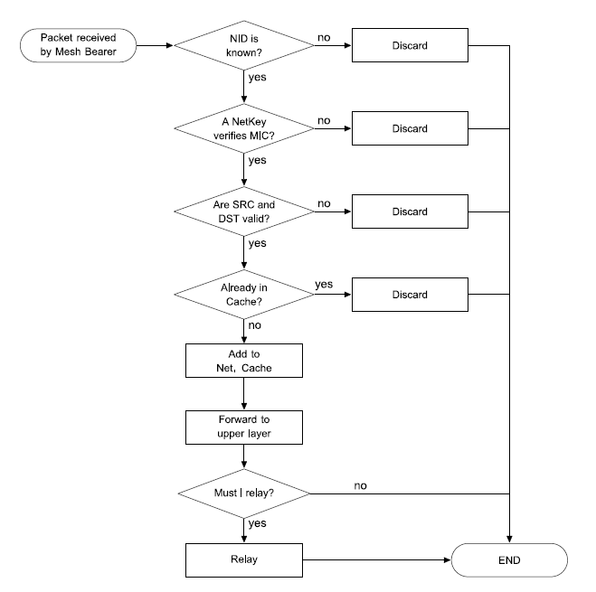

# Mesh networking

## Bearers

This specification defines two mesh bearers over which mesh messages may be transported:

* An advertising bearer 
* A GATT bearer

### Advertising bearer

When using the advertising bearer, a mesh packet shall be sent in the Advertising Data of a Bluetooth Low Energy advertising PDU using the Mesh Message AD Type identified by «Mesh Message» as defined [Bluetooth SIG Assigned Numbers](http://www.bluetooth.com/specifications/assigned-numbers).

The Mesh Message AD Type contains a Network PDU as defined in Table 1.1.

Any advertisement using the Mesh Message AD Type shall be **non-connectable and non-scannable undirected advertising events**. **If a node receives a Mesh Message AD Type in a connectable advertisement or scannable advertising event, the message shall be ignored.**

A device supporting only the advertising bearer should perform passive scanning with a duty cycle as close to 100 percent as possible in order to avoid missing any incoming mesh messages or Provisioning PDUs. 

All devices shall support both the GAP Observer role and GAP Broadcaster role.

### GATT bearer

The GATT bearer is provided to enable devices that are not capable of supporting the advertising bearer to participate in a mesh network. The GATT bearer uses the **Proxy protocol** to transmit and receive Proxy PDUs between two devices over a GATT connection.

The GATT bearer uses **a characteristic to write to and receive notifications of mesh messages** using the attribute protocol. 

The GATT bearer defines two roles: a GATT Bearer Client and a GATT Bearer Server. 

The GATT Bearer Client shall be a GATT Client. The GATT Bearer Server shall be a GATT Server. The GATT Bearer Server shall instantiate one and only one Mesh Proxy Service.

The GATT Bearer Client shall support the **Mesh Proxy Service**.

The GATT Bearer Client shall perform primary service discovery using either the **GATT Discover All Primary Services sub-procedure** or the **GATT Discover Primary Services by Service UUID sub-procedure** to discover the **Mesh Proxy Service**.

As required by GATT, the GATT Bearer Client must be tolerant of additional optional characteristics in the service records of services used with this profile.

The GATT Bearer Client shall use either the **GATT Discover All Characteristics of a Service sub- procedure** or the **GATT Discover Characteristics by UUID sub-procedure** to discover the **characteristics of the service**.

The GATT Bearer Client shall use the **GATT Discover All Characteristic Descriptors sub-procedure** to discover the **characteristic descriptors**. 

The GATT Bearer Client shall discover the **Mesh Proxy Data In characteristic,** **Mesh Proxy Data Out characteristic** and its **Client Characteristic Configuration descriptor**. **Once the Client Characteristic Configuration descriptor has been discovered, it shall enable notifications using this characteristic.** 

To send a Proxy PDU, the GATT Bearer Client shall use the **Write Without Response sub-procedure** to write the Proxy PDU to the GATT Bearer Server by writing to the Mesh Proxy Data In characteristic. 

To receive a Proxy PDU, the GATT Bearer Client shall be able to **receive multiple notifications of the Mesh Proxy Data Out characteristic**. Each notification contains a single Proxy PDU.

## Network layer

### Addresses

The network layer defines four basic types of addresses: **unassigned**, **unicast**, **virtual**, and **group**.

**Addresses are 16 bits in length** and are encoded as defined in Table below.

| Values | Address Type |
| :--- | :--- |
| 0b0000000000000000 | Unassigned Address |
| 0b0xxxxxxxxxxxxxxx \(excluding 0b0000000000000000\) | Unicast Address |
| 0b10xxxxxxxxxxxxxx | Virtual Address |
| 0b11xxxxxxxxxxxxxx | Group Address |

1. Unassigned address 

**An unassigned address is an address in which the element of a node has not been configured yet or no address has been allocated.** The unassigned address shall have the value 0x0000 . This may be used, for example, to disable message publishing of a model by setting the publish address of a model to the unassigned address.

**An unassigned address shall not be used in a source or destination address field of a message.**

2. Unicast address 

**A unicast address is a unique address allocated to each element.** A unicast address has bit 15 set to 0. The unicast address shall not have the value 0x0000, and therefore can have any value from 0x0001 to 0x7FFF inclusive as shown in Figure 3.4 below. 

A unicast address is **allocated** to each element of a node for the lifetime of the node on the network by a Provisioner during **provisioning** as described in Section 5.4.2.5 **Distribution of provisioning data**. The address may be **unallocated** by a Provisioner to allow the address to be reused using the procedure defined in Section 3.10.7 **Node Removal procedure**.

A unicast address shall be used in the source address field of a message and may be used in the destination address field of a message. A message sent to a unicast address shall be processed by at most one element.

3. Virtual address

**A virtual address represents a set of destination addresses.** Each virtual address logically represents a Label UUID, which is a 128-bit value that does not have to be managed centrally. One or more elements may be programmed to publish or subscribe to a Label UUID. The Label UUID is not transmitted and shall be used as the Additional Data field of the message integrity check value in the upper transport layer.

The virtual address is a 16-bit value that has bit 15 set to 1, bit 14 set to 0, and **bits 13 to 0 set to the value of a hash**. **This hash is a derivation of the Label UUID such that each hash represents many Label UUIDs.**

When an **Access message** is received to a virtual address that has a matching hash, each corresponding Label UUID is used by the upper transport layer as additional data as part of the authentication of the message until a match is found.

**Control messages** cannot use virtual addresses.

Label UUIDs may be generated randomly as defined in \[8\]. A Configuration Client may assign and track virtual addresses, however two devices can also create a virtual address using some out-of-band \(OOB\) mechanism. Unlike group addresses, these could be agreed upon by the devices involved and would not need to be registered in the centralized provisioning database, as they are unlikely to be duplicated. 

A disadvantage of virtual addresses is that a multi-segment message is required to transfer a Label UUID to a publishing or subscribing node during configuration. 

A virtual address can have any value from 0x8000 to 0xBFFF as shown in Figure 3.5 below.

4. Group address

A group address is an address that is programmed into zero or more elements. A group address has bit 15 set to 1 and bit 14 set to 1., as shown in Figure 3.6 below. Group addresses in the range 0xFF00 through 0xFFFF are reserved for Fixed Group addresses \(see Table 3.4\), and addresses in the range 0xC000 through 0xFEFF are generally available for other usage.

A group address shall only be used in the destination address field of a message. A message sent to a group address shall be delivered to all the instances of models that subscribe to this group address. There are two types of group address; those that can be assigned dynamically and those that are fixed. The fixed group addresses are defined in Table 3.4 below.

| Values | Fixed Group Address Name |
| :--- | :--- |
| 0xFF00–0xFFFB | RFU |
| 0xFFFC | all-proxies |
| 0xFFFD | all-friends |
| 0xFFFE | all-relays |
| 0xFFFF | all-nodes |

A message sent to the all-proxies address shall be processed by the primary element of all nodes that have the proxy functionality enabled. 

A message sent to the all-friends address shall be processed by the primary element of all nodes that have the friend functionality enabled. 

A message sent to the all-relays address shall be processed by the primary element of all nodes that have the relay functionality enabled. 

A message sent to the all-nodes address shall be processed by the primary element of all nodes.

### Address validity

Table 3.5 shows which address types are valid for use in the Source Address field and the Destination Address field.

| Address Type | Valid in Source Address Field | Valid in Destination Address Field |  |
| :--- | :--- | :--- | :--- |
|  |  | Segmented and Unsegmented Control Messages | Segmented and Unsegmented Access Messages |
| Unassigned Address | No | No | No |
| Unicast Address | Yes | Yes | Yes |
| Virtual Address | No | No | Yes |
| Group Address | No | Yes | Yes |

Table 3.6 shows which address types are valid for use with device keys and application keys.

| Address Type | Valid with Device Key | Valid with Application Key |
| :--- | :--- | :--- |
| Unassigned Address | No | No |
| Unicast Address | Yes | Yes |
| Virtual Address | No | Yes |
| Group Address | No | Yes |

### Network PDU

The mesh Network PDU format is defined in Table 3.7 and illustrated in Figure 3.7 below:

| Field Name | Bits | Notes |
| :--- | :--- | :--- |
| IVI | 1 | Least significant bit of IV Index |
| NID | 7 | Value derived from the NetKey used to identify the Encryption Key and Privacy Key used to secure this PDU |
| CTL | 1 | Network Control |
| TTL | 7 | Time To Live |
| SEQ | 24 | Sequence Number |
| SRC | 16 | Source Address |
| DST | 16 | Destination Address |
| TransportPDU | 8 to 128 | Transport Protocol Data Unit |
| NetMIC | 32 or 64 | Message Integrity Check for Network |

### Network interfaces 

The network layer supports sending and receiving messages via multiple bearers. Multiple instances of a bearer may be present. Each instance of a bearer is connected to the network layer via a network interface. To allow sending messages between elements within the same node the local interface is used. 

For example, a node may have three interfaces: one used to send and receive messages via an advertising bearer and two interfaces to a GATT bearer, one for each client connected via a GATT connection. 

Interfaces provide input and output filters. Filters may be configured using bearer-specific PDUs or internally by services exposed on a node, such as the Mesh Proxy Service.

### Network layer behavior

1. Relay feature 

The Relay feature is used to relay/forward Network PDUs received by a node over the advertising bearer. This feature is optional and if supported can be enabled and disabled. If the Proxy feature is supported, then both GATT and advertising bearers shall be supported.

2. Proxy feature 

The Proxy feature is used to relay/forward Network PDUs received by a node between GATT and advertising bearers. This feature is optional and if supported can be enabled and disabled. When this feature is supported, the Mesh Proxy Service \(see Section 7.2\) shall be exposed.

3. Receiving a Network PDU 

A message is delivered from a bearer to the network layer via a network interface. The interface shall apply filtering rules defined by its input filter \(see Section 3.4.5.1\). If the message passes the input filter, it is delivered to the network layer for further processing. 

Each Network PDU that is received can be tagged with additional metadata that can be used later to change the processing of this message. 

Upon receiving a message, the node shall check if the value of the NID field value matches one or more known NIDs. If the NID field value does not match a known NID, then the message shall be ignored. If the NID field value matches a known NID, the node shall authenticate the message against each known network key that matched. If the message does not authenticate against any known network key, then the message shall be ignored. If the message does authenticate against a network key, the SRC and DST fields are considered valid \(see Section 3.4.3\), and the message is not in the Network Message Cache \(see Section 3.4.6.5\), then the message shall be processed by the lower transport layer. 

When a message is retransmitted, as defined below, the IV Index used when retransmitting the message shall be the same as the IV Index when it was received. 

If the message delivered from the advertising bearer is processed by the lower transport layer, the Relay feature is supported and enabled, the TTL field has a value of 2 or greater, and the destination is not a unicast address of an element on this node, then the TTL field value shall be decremented by 1, the Network PDU shall be tagged as relay, and the Network PDU shall be retransmitted to all network interfaces connected to the advertising bearer. It is recommended that a small random delay is introduced between receiving a Network PDU and relaying a Network PDU to avoid collisions between multiple relays that have received the Network PDU at the same time. 

If the message delivered from the GATT bearer is processed by the lower transport layer, and the Proxy feature is supported and enabled, and the TTL field has a value of 2 or greater, and the destination is not a unicast address of an element on this node, then the TTL field value shall be decremented by 1, and the Network PDU shall be retransmitted to all network interfaces. 

If the message delivered from the advertising bearer is processed by the lower transport layer, and the Proxy feature is supported and enabled, and the TTL field has a value of 2 or greater, and the destination is not a unicast address of an element on this node, then the TTL field shall be decremented by 1 and the Network PDU shall be retransmitted to all network interfaces connected to the GATT bearer.

Figure 3.8 illustrates an example of processing steps for an incoming Network PDU:

4. Transmitting a Network PDU

Messages are transmitted by an element in the context of a mesh subnet, which is identified by a unique network key. 

The IVI field shall be set to the least significant bit of the IV Index value being used to transmit for the mesh subnet. 

The NID field shall be set to the NID value associated with the Encryption Key and Privacy Key used for encryption and obfuscation. 

The CTL field shall be set by a higher layer.

The TTL field shall be set by a higher layer. 

The SEQ field shall be set by the network layer to the sequence number of the element. The sequence number shall then be incremented by one for every new Network PDU. 

The SRC field shall be set by the network layer to the unicast address of the element that is sending this Network PDU. 

The DST field shall be set to a unicast address, a group address, or a virtual address to identify the destination element or elements and shall be set by the lower transport, upper transport, or access layer. 

The TransportPDU field shall be set by a higher layer. 

The NetMIC field shall be set as defined in Section 3.8.7.2. 

The message shall be delivered to all network interfaces. Each interface shall apply filtering rules defined by its output filter \(see Section 3.4.5.2\). If the Network PDU passes the output filter, it shall be transmitted on a bearer.

5 Network Message Cache

In order to reduce unnecessary security checks and excessive relaying, a node shall include a Network Message Cache of all recently seen Network PDUs. If a Network PDU is received that is already in the Network Message Cache, then the Network PDU shall not be processed \(i.e., it shall be immediately discarded\). If a Network PDU is received and that Network PDU is not in the Network Message Cache, then the Network PDU can be processed \(e.g., checked against network security\), and if it is a valid Network PDU, it shall be stored in the Network Message Cache. 

The node is not required to cache the entire Network PDU and may cache only part of it for tracking, such as values for NetMIC, SRC/SEQ or others. However, this is left to the implementation as long as the condition of not processing the same Network PDU more than once is achieved within the limits of the device capabilities. 

When the Network Message Cache is full and an incoming new Network PDU needs to be cached, an incoming new Network PDU shall replace the oldest Network PDU that is already in the Network Message Cache. 

The Network Message Cache shall be able to store at least two Network PDUs, although it is highly recommended to have a Network Message Cache size appropriate to the anticipated network density. The details of the incoming message processing procedure are left to the implementation.

## Lower transport layer

The lower transport layer takes an Upper Transport PDU from the upper transport layer and transmits those messages to a peer lower transport layer. These Upper Transport PDUs may fit into a single Lower Transport PDU, or may be segmented into multiple Lower Transport PDUs. Upon receiving messages, the lower transport layer processes Lower Transport PDUs, reassembling Upper Transport PDUs from possibly multiple PDUs and sending these up to the upper transport layer once reassembly is complete.

### Lower Transport PDU 

The Lower Transport PDU is used to transmit Upper Transport PDUs to another node. The most significant bit of the first octet of the Lower Transport PDU is the SEG field, which is used to determine if the Lower Transport PDU is formatted as a segmented or unsegmented message. There are four formats used, depending on the value of the CTL field in the Network PDU and the SEG field in the Lower Transport PDU as defined in Table 3.9 below.

| CTL Field | SEG Field | Lower Transport PDU Format |
| :--- | :--- | :--- |
| 0 | 0 | Unsegmented Access Message |
| 0 | 1 | Segmented Access Message |
| 1 | 0 | Unsegmented Control Message |
| 1 | 1 | Segmented Control Message |

## Upper transport layer

## Access layer

## Mesh security

## Mesh beacons

## Mesh network management

## Message processing flow

