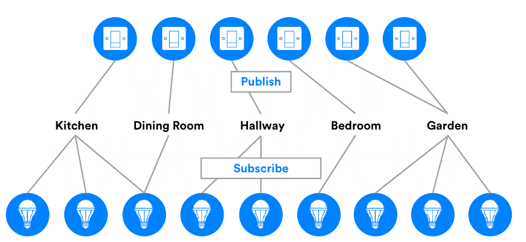

# Bluetooth Mesh Basics

## Mesh vs. Point-to-Point

Most Bluetooth LE devices communicate with each other using a simple point-to-point network topology enabling one-to-one device communications. In the Bluetooth core specification, this is called a ‘piconet.’

Imagine a smartphone that has established a point-to- point connection to a heart rate monitor over which it can transfer data. One nice aspect of Bluetooth is that it enables devices to set up multiple connections. **That same smartphone can also establish a point-to- point connection with an activity tracker. In this case, the smartphone can communicate directly with each of the other devices, but the other devices cannot communicate directly with each other.**

In contrast, a **mesh network has a many-to-many topology, with each device able to communicate with every other device in the mesh**. Communication is achieved using messages, and devices are able to relay messages to other devices so that the end-to-end communication range is extended far beyond the radio range of each individual node.

> 大多数低功耗蓝牙设备使用简单的点对点网络拓扑相互通信，从而实现一对一的设备通信。在蓝牙核心规范中，这称为“微微网”。
>
> 想象一下，一部智能手机已经建立了与心率监测器的点对点连接，并可以通过它传输数据。蓝牙的一个不错的方面是它使设备能够建立多个连接。该智能手机还可以与活动跟踪器建立点对点连接。在这种情况下，智能手机可以与其他每个设备直接通信，而其他设备之间则不能直接通信。
>
> 相反，Mesh 网络具有多对多拓扑，每个设备都能够与 Mesh 网络中的每个其他设备进行通信。设备间使用消息进行通信，并且设备能够将消息中继到其他设备，从而端到端的通信范围扩展到远远超出每个单独节点的无线电覆盖范围。

## Devices and Nodes

**Devices** which are part of a mesh network are called **nodes** and those which are not are called “**unprovisioned devices**”.

The process which transforms an unprovisioned device into a node is called “**provisioning**”. Consider purchasing a new Bluetooth light with mesh support, bringing it home and setting it up. To make it part of your mesh network, so that it can be controlled by your existing Bluetooth light switches and dimmers, you would need to provision it.

Provisioning is a secure procedure which results in **an unprovisioned device possessing a series of encryption keys** and being known to the Provisioner device, typically a tablet or smartphone. One of these keys is called the **network key or NetKey for short**.

All nodes in a mesh network possess at least one NetKey and it is possession of this key which makes a device a member of the corresponding network and as such, a node. There are other requirements that must be satisfied before a node can become useful, but **securely acquiring a NetKey through the provisioning process is a fundamental first step**.

> 属于 Mesh 网络中的设备称为节点，不属于 Mesh 网络中的设备称为“未配置设备”。
>
> 将未配网的设备转换为节点的过程称为**“配网”**。想象一下，购买一个支持 Mesh 的新蓝牙灯，将其带回家并进行安装。为了使其成为 Mesh 网络的一部分，以便可以通过现有的蓝牙灯光开关和调光器对其进行控制，您需要对其进行配置。
>
> 配网是一种安全过程，将让未配置设备拥有一系列加密密钥，并且对于配网器设备（通常是平板电脑或智能手机）是已知的。这些密钥之一称为网络密钥或 NetKey。
>
> Mesh 网络中的所有节点都拥有至少一个 NetKey，正是该密钥的拥有使设备成为相应网络的成员，因此成为一个节点。在节点变得可用之前，还必须满足其他要求，但是通过配网过程安全地获取 NetKey 是基本的第一步。

## Elements

Some nodes have multiple, constituent parts, **each of which can be independently controlled**. In Bluetooth mesh terminology, these parts are called **elements**. For example, an LED lighting product with three LED lights which if added to a Bluetooth mesh network, would form a single node with three elements, one for each of the individual LED lights.

> 一些节点具有多个组成部分，每个部分都可以独立控制。在蓝牙 Mesh 网络术语中，这些部分称为元素。例如，具有三个 LED 灯的 LED 照明产品（如果添加到蓝牙 Mesh 网络中）将形成具有三个元素的单个节点，每个单独的 LED 灯是一个元素。

## Messages

When a node needs to query the status of other nodes or needs to control other nodes in some way, it sends a message of a suitable type. If a node needs to report its status to other nodes, it sends a message. **All communication in the mesh network is “message-oriented” and many message types are defined, each with its own, unique opcode.**

Messages fall within one of two broad categories; **acknowledged or unacknowledged.**

**Acknowledged messages** require a response from nodes that receive them. The response serves two purposes: it confirms that the message it relates to was received, and it returns data relating to the message recipient to the message sender.

The sender of an acknowledged message may resend the message if it does not receive the expected response\(s\) and therefore, acknowledged messages must be idempotent. This means that the effect of a given acknowledged message, arriving at a node multiple times, will be the same as it had only been received once.

**Unacknowledged messages** do not require a response.

> 当节点需要查询其他节点的状态或需要以某种方式控制其他节点时，它会发送适当类型的消息。如果某个节点需要向其他节点报告其状态，则会发送一条消息。Mesh 网络中的所有通信都是“面向消息的”，并且定义了许多消息类型，每种类型都有自己的唯一操作码。
>
> 消息属于两大类之一；**确认或未确认**。
>
> 确认的消息需要接收它们的节点的响应。响应有两个目的：确认已收到与之相关的消息，并将与消息接收者有关的数据返回给消息发送者。
>
> 如果确认的消息的发送者未收到预期的响应，则可以重新发送该消息，因此，确认的消息必须是幂等的。这意味着多次收到一个节点的确认消息的效果与只收到一次的效果相同。
>
> 未确认的消息不需要响应。

## Addresses

Messages must be sent from and to an address. Bluetooth mesh defines three types of address.

**A unicast address** uniquely identifies a single element. Unicast addresses are assigned to devices during the provisioning process.

**A group address** is a multicast address which represents one or more elements. Group addresses are either defined by the Bluetooth Special Interest Group \(SIG\) and are known as SIG Fixed Group Addresses or are assigned dynamically. 4 SIG Fixed Group Addresses have been defined. These are named All-proxies, All-friends, All-relays and All-nodes. The terms Proxy, Friend, and Relay will be explained later in this paper.

It is expected that dynamic group addresses will be established by the user via a configuration application and that they will reflect the physical configuration of a building, such as defining group addresses which correspond to each room in the building.

**A virtual address** is an address which may be assigned to one or more elements, spanning one or more nodes. It takes the form of a 128-bit UUID value with which any element can be associated and is much like a label.

Virtual addresses will likely be preconfigured at the point of manufacture and be used for scenarios such as allowing the easy addressing of all meeting room projectors made by this manufacturer.

> 消息必须从一个地址发送到另一个地址。蓝牙 Mesh 定义了三种地址类型。
>
> **单播地址**唯一地标识单个元素。在配置过程中，将单播地址分配给设备。
>
> **组地址**是代表一个或多个元素的多播地址。组地址由蓝牙特殊兴趣组（SIG）定义，被称为 SIG 固定组地址，或者是动态分配的。已经定义了 4 个 SIG 固定组地址。这些被称为“所有代理”，“所有朋友”，“所有中继”和“所有节点”。代理，朋友和中继一词将在本文后面解释。
>
> 用户可以通过配置应用程序建立动态组地址，并且动态组地址将反映建筑物的物理配置，例如定义与建筑物中每个房间相对应的组地址。
>
> **虚拟地址**是一种可以分配给一个或多个元素的地址，跨越一个或多个节点。它采用128位UUID值的形式，任何元素都可以与之关联，并且很像标签。
>
> 虚拟地址可能会在制造时进行预先配置，并用于一些场景，例如允许轻松寻址该制造商生产的所有会议室投影仪。

## Publish/Subscribe

The act of sending a message is known as **publishing**. Nodes are configured to select messages sent to specific addresses for processing, and this is known as **subscribing**.

Typically, messages are addressed to group or virtual addresses. Group and virtual address names will have readily understood meaning to the end user, making them easy and intuitive to use. In Figure 1, above, we can see that the node “Switch 1” is publishing to group address Kitchen. Nodes Light 1, Light 2, and Light 3 each subscribe to the Kitchen address and therefore receive and process messages published to this address. In other words, Light 1, Light 2, and Light 3 can be switched on or off using Switch 1.

Switch 2 publishes to the group address Dining Room. Light 3 alone subscribed to this address and so is the only light controlled by Switch 2. Note that this example Figure 1 - Publish/Subscribe also illustrates the fact that nodes may subscribe to messages addressed to more than one distinct address. This is both powerful and flexible.

Similarly, notice how both nodes Switch 5 and Switch 6 publish to the same Garden address.

The use of group and virtual addresses with the publish/ subscribe communication model has an additional, substantial benefit in that removing, replacing or adding new nodes to the network does not require reconfiguration of other nodes. Consider what would be involved in installing an additional light in the dining room. The new device would be added to the network using the provisioning process and configured to subscribe to the Dining Room address. No other nodes would be affected by this change to the network. Switch 2 would continue to publish messages to Dining Room as before but now, both Light 3 and the new light would respond.

> 发送消息的行为称为发布。节点可被配置为接收并处理发送到特定地址的消息，这称为订阅。
>
> 通常，消息被寻址到组或虚拟地址。组和虚拟地址名称对于最终用户而言将很容易理解，使它们易于使用和直观。在上面的图1中，我们可以看到节点“ Switch 1”正在发布到组地址 Kitchen。节点 Light 1，Light 2 和 Light 3 各自订阅了 Kitchen 地址，因此接收并处理发布到该地址的消息。换句话说，可以使用开关1打开或关闭灯1，灯2和灯3。
>
> 开关2发布到组地址 Dining Room。灯3单独订阅了该地址，因此是开关2唯一控制的灯。请注意，此示例图1-发布/订阅还说明了以下事实：节点可以订阅寻址到多个不同地址的消息。这既强大又灵活。
>
> 同样，请注意开关5和开关6这两个节点如何发布到相同的 Garden 地址。
>
> 在发布/订阅通信模型中使用组地址和虚拟地址还有一个额外的实质性好处，在网络上删除，替换或添加新节点不需要重新配置其他节点。考虑一下，在餐厅中安装额外的灯会涉及什么。新设备将使用配置过程添加到网络中，并配置为订阅饭厅地址。网络的更改不会影响其他节点。开关2将像以前一样继续向餐厅发布消息，但是现在，灯3和新灯都将响应。

## States and Properties

Elements can be in various conditions and this is represented in Bluetooth mesh by the **concept of state** values.

**A state is a value of a certain type, contained within an element** \(within a server model - see below\). As well as values, States also have associated behaviors and may not be reused in other contexts.

As an example, consider a simple light which may either be on or off. **Bluetooth mesh defines a state called Generic OnOff**. The light would possess this state item and a value of On would correspond to and cause the light to be illuminated whereas a Generic OnOff state value of Off would reflect and cause the light to be switched off.

The significance of the term Generic will be discussed later.

**Properties are similar to states** in that they contain values relating to an element. But they are significantly different to states in other ways.

Readers who are familiar with Bluetooth LE will be aware of characteristics and recall that they are data types with no defined behaviors associated with them, making them reusable across different contexts. A property provides the context for interpreting a characteristic.

To appreciate the significance and use of contexts as they relate to properties, consider for example, the characteristic **Temperature 8, an 8-bit temperature** _**state**_ **type which has a number of associated** _**properties**_**, including Present Indoor Ambient Temperature and Present Outdoor Ambient Temperature.** These two properties allow a sensor to publish sensor readings in a way that allows a receiving client to determine the context the temperature value has, making better sense of its true meaning.

**Properties are organized into two categories: Manufacturer, which is a read-only category and Admin which allows read-write access.**

> 元素可以处于各种条件下，这在蓝牙 Mesh 中由状态值的概念表示。
>
> 状态是元素中包含的某种类型的值（在服务器模型内-参见下文）。除了状态值外，状态还具有相关的行为，在其他情况下可能无法重复使用。
>
> 例如，考虑一个可以打开或关闭的简单灯。蓝牙 Mesh 定义了一个称为 Generic OnOff 的状态。灯光将具有此状态项，并且“开”的值对应于并导致该灯被照亮，而 Generic OnOff ”的“关闭”状态值则对应于并导致该灯被关闭。
>
> 通用一词的含义将在后面讨论。
>
> 属性与状态相似，因为它们包含与元素有关的值。但是它们在其他方面与状态有很大不同。
>
> 熟悉低功耗蓝牙的读者将意识到这些特性，并回想它们是没有定义行为的数据类型，从而使它们可以在不同的上下文中重用。属性为解释特征提供了上下文。
>
> 为了理解与属性相关的上下文的重要性和使用，请考虑以下特征：温度8，这是一种8位温度状态类型，具有多种相关属性，包括当前室内环境温度和当前室外环境温度。这两个属性允许传感器发布传感器读数，接收方客户端将确定温度值所处环境，从而更好地理解其真实含义。
>
> 属性分为两类：制造商（这是只读类别）和管理（其允许读写访问）。

## Messages, States and Properties

**Messages are the mechanism by which operations on the mesh are invoked.** Formally, a given message type represents an operation on a state or collection of multiple state values. All messages are of three broad types, reflecting the types of operation which Bluetooth mesh supports. The shorthand for the three types is **GET**, **SET** and **STATUS**.

**GET** messages **request the value of a given state** from one or more nodes. A STATUS message is sent in response to a GET and contains the relevant state value.

**SET** messages **change the value of a given state**. An acknowledged SET message will result in a STATUS message being returned in response to the SET message whereas an unacknowledged SET message requires no response.

**STATUS** messages are sent in response to GET messages, acknowledged SET messages or independently of other messages, perhaps driven by a timer running on the element sending the message, for example.

**Specific states referenced by messages are inferred from the message opcode. Properties on the other hand, are referenced explicitly in generic property related messages using a 16-bit property ID.**

> 消息是操作 Mesh 网络的机制。形式上，给定的消息类型表示对一个状态或多个状态值集合的操作。所有消息均分为三种类型，反映了蓝牙 Mesh 支持的操作类型。这三种类型的简写是 GET，SET 和STATUS。
>
> GET 消息从一个或多个节点请求给定状态的值。发送状态消息以响应 GET，并包含相关状态值。
>
> SET 消息更改给定状态的值。使用带确认的 SET 消息将需要接收节点返回 STATUS 消息以响应 SET 消息，而使用不需要确认的 SET 消息则不需要响应。
>
> STATUS 消息是响应 GET 消息、带确认的 SET 消息而发送的，或者独立于其他消息而发送，例如，可能由元素周期性发送消息。
>
> 从消息操作码中推断出消息引用的特定状态。另一方面，在与通用属性相关的消息中使用16位属性ID显式引用属性。

## State Transitions

**Changes from one state to another are called state transitions.** Transitions may be instantaneous or execute over a period of time called the transition time. A state transition is likely to have an effect on the application layer behavior of a node.

> 从一种状态到另一种状态的更改称为状态转换。状态转换可以是瞬时的，也可以在一段时间（称为过渡时间）内执行。状态转换可能会影响节点的应用程序层行为。

## Bound States

**Relationships may exist between states whereby a change in one triggers a change in the other.** Such a relationship is called a **state binding**. One state may be bound to multiple other states.

For example, consider a light controlled by a dimmer switch. The light would possess the two states, Generic OnOff and Generic Level with each bound to the other. Reducing the brightness of the light until Generic Level has a value of zero \(fully dimmed\) results in Generic OnOff transitioning from On to Off.

> 状态之间可能存在关系，一个状态的变化触发另一状态的变化。 这种关系称为状态绑定。一个状态可以绑定到多个其他状态。
>
> 例如，考虑由调光开关控制的灯。灯光将具有两个状态，通用开关和通用级别，每个状态相互绑定。 降低灯光的亮度，直到“通用级别”的值为零（完全变暗）会导致“通用开关”从“打开”转换为“关闭”。

## Models

**Models pull the preceding concepts together and define some or all of the functionality of an element as it relates to the mesh network.** Three categories of model are recognized.

A **server model** defines a collection of states, state transitions, state bindings and messages which the element containing the model may send or receive. It also defines behaviors relating to messages, states and state transitions.

A **client model** does not define any states. Instead, it defines the messages which it may send or receive in order to GET, SET or acquire the STATUS of states defined in the corresponding server model.

**Control models** contain both a server model, allowing communication with other client models and a client model which allows communication with server models.

**Models may be created by extending other models.** A model which is not extended is called a root model.

**Models are immutable**, meaning that they may not be changed by adding or removing behaviors. The correct and only permissible approach to **implementing new model requirements is to extend the existing model**.

> 模型将前面的概念组合在一起，并定义了与 Mesh 网络相关的元素的部分或全部功能。可以识别三类模型。
>
> 服务器模型定义了包含该模型的元素可以发送或接收的状态，状态转换，状态绑定和消息的集合。它还定义了与消息，状态和状态转换有关的行为。
>
> 客户模型没有定义任何状态。相反，它定义了可以发送或接收的消息，以获取，设置或获取在相应服务器模型中定义的状态的状态。
>
> 控制模型既包含允许与其他客户端模型进行通信的服务器模型，也包含允许与服务器模型进行通信的客户端模型。
>
> 可以通过扩展其他模型来创建模型。未扩展的模型称为根模型。
>
> 模型是不可变的，这意味着不能通过添加或删除行为来更改它们。实施新模型要求的正确且唯一允许的方法是扩展现有模型。

## Generics

It is recognized that many different types of device, often have semantically equivalent states, as exemplified by the simple idea of ON vs OFF. Consider lights, fans and power sockets, all of which can be switched on or turned off.

Consequently, the **Bluetooth mesh model specification, defines a series of reusable, generic states** such as, for example, Generic OnOff and Generic Level.

Similarly, a series of generic messages that operate on the generic states are defined. Examples include Generic OnOff Get and Generic Level Set.

Generic states and generic messages are used in generalized models, both generic server models such as the Generic OnOff Server and Generic Client Models such as the Generic Level Client.

Generics allow a wide range of device type to support Bluetooth mesh without the need to create new models. **Remember that models may be created by extending other models** too. As such, generic models may form the basis for quickly creating models for new types of devices.

> 公认的是，许多不同类型的设备通常具有语义上相等的状态，如“开”与“关”。考虑灯，风扇和电源插座，所有这些都可以打开或关闭。
>
> 因此，蓝牙 Mesh 模型规范定义了一系列可重用的通用状态，例如，通用 OnOff 和通用级别。
>
> 类似地，定义了在通用状态下操作的一系列通用消息。 例如，“通用 OnOff 获取消息”和“通用级别设置消息”。
>
> 通用状态和通用消息用于通用模型，通用服务器模型（例如 Generic OnOff Server）和通用客户端模型（例如 Generic Level Client）都适用。
>
> 通用模型允许广泛的设备类型支持蓝牙 Mesh，而无需创建新模型。请记住，也可以通过扩展其他模型来创建模型。 这样，通用模型可以作为快速创建新模型的基础。

## Scenes

**A scene is a stored collection of states which may be recalled and made current by the receipt of a special type of message or at a specified time. Scenes are identified by a 16-bit Scene Number**, which is unique within the mesh network. Scenes allow a series of nodes to be set to a given set of previously stored, complimentary states in one coordinated action.

Imagine that in the evening, you like the temperature in your main family room to be 20 degrees Celsius, the six LED downlights to be at a certain brightness level and the lamp in the corner of the room on the table, set to a nice warm yellow hue. Having manually set the various nodes in this example scenario to these states, you can store them as a scene using a configuration application, and recall the scene later on, either on demand by sending an appropriate, scene-related mesh message or automatically at a scheduled time.

> 场景是状态的存储集合，可以通过接收特殊类型的消息或在指定时间将其调回并使其成为最新状态。场景由16位场景编号标识，该编号在 Mesh 网络中是唯一的。场景允许在一个协调的动作中将一系列节点设置为一组给定的先前存储的互补状态。
>
> 想象一下，在晚上，您希望您的主要家庭房间的温度为 20 摄氏度，六个 LED 筒灯处于一定的亮度水平，桌子上的房间角落的灯被设置为暖黄色。在此示例场景中将各个节点手动设置为这些状态后，您可以使用配置应用程序将它们存储为场景，之后可以通过发送与场景相关的 Mesh 消息调用场景，或者在设置的时间点调用场景。

## Provisioning

**Provisioning is the process by which a device joins the mesh network and becomes a node.** It involves several stages, results in various security keys being generated and is itself a secure process.

Provisioning is accomplished using an application on a device such as a tablet. In this capacity, the device used to drive the provisioning process is referred to as the **Provisioner**.

The provisioning process progresses through five steps and these are described next.

> 配网是设备加入 Mesh 网络并成为节点的过程。它涉及多个阶段，将生成各种安全密钥，它本身就是一个安全的过程。
>
> 使用平板电脑之类的设备上的应用程序即可完成配置。 以这种身份，用于启动配置过程的设备称为配网器。
>
> 配网过程分为五个步骤，下面将介绍这些步骤。

### **Step 1. Beaconing**

In support of various different Bluetooth mesh features, including but not limited to provisioning, new GAP AD types \(ref: Bluetooth Core Specification Supplement\) have been introduced, including the &lt;Mesh Beacon&gt; AD type.

**An unprovisioned device indicates its availability to be provisioned by using the &lt;Mesh Beacon&gt; AD type in advertising packets.** The user might need to start a new device advertising in this way by, for example, pressing a combination of buttons or holding down a button for a certain length of time.

> 为了支持各种不同的蓝牙 Mesh 功能，包括但不限于配置，引入了新的GAP 广播类型（参考：蓝牙核心规范补充），包括 &lt;Mesh Beacon&gt; 广播类型。
>
> 未配置设备将通过在广播数据包中使用 &lt;Mesh Beacon&gt; 广播类型来表示该设备可以被配置。用户可能需要以一种方式开始新的设备广播，例如，通过按下按钮的组合或按住按钮一定时间。

### **Step 2. Invitation**

**In this step, the Provisioner sends an invitation to the device to be provisioned, in the form of a Provisioning Invite PDU.** The Beaconing device responds with information about itself in a Provisioning Capabilities PDU.

> 在此步骤中，配网器以配置邀请 PDU 的形式向未配置设备发送邀请。未配置设备使用配置功能 PDU 中有关其自身的信息进行响应。

### **Step 3. Exchanging Public Keys**

**The Provisioner and the device to be provisioned, exchange their public keys, which may be static or ephemeral, either directly or using an out-of-band \(OOB\) method.**

> 配网器和未配置设备直接或使用带外（OOB）方法交换其公共密钥，这些公共密钥可以是静态的或临时的。

### **Step 4. Authentication**

**During the authentication step, the device to be provisioned outputs a random, single or multi-digit number to the user in some form, using an action appropriate to its capabilities.** For example, it might flash an LED several times. The user enters the digit\(s\) output by the new device into the Provisioner and a cryptographic exchange takes place between the two devices, involving the random number, to complete the authentication of each of the two devices to the other.

> 在认证步骤中，未配置设备使用适合其功能的操作以某种形式向用户输出随机、一位或多位数字。例如，它可能使 LED 闪烁几次。用户将新设备输出的数字输入到配网器中，并且在这两个设备之间进行加密交换（涉及随机数），以完成两个设备彼此之间的认证。

### **Step 5. Distribution of the Provisioning Data**

**After authentication has successfully completed, a session key is derived by each of the two devices from their private keys and the exchanged, peer public keys.** The session key is then used to secure the subsequent distribution of the data required to complete the provisioning process, including a security key known as the network key \(NetKey\).

After provisioning has completed, the provisioned device possesses the network’s **NetKey**, a mesh security parameter known as the **IV Index** and **a Unicast Address**, allocated by the Provisioner. It is now known as a node.

> 身份验证成功完成后，两个设备中的每一个都将从其私钥和交换的对等公钥派生会话密钥。然后，使用会话密钥来保护完成配置过程所需的数据分发，其中包括网络密钥（NetKey）。
>
> 配置完成后，未配置设备就可以称为节点。它将拥有网络的 NetKey，由配网器分配的 mesh 安全参数（称为 IV 索引）和单播地址。

## Features

All nodes can transmit and receive mesh messages but there are a number of optional features which a node may possess, giving it additional, special capabilities. There are four such optional features: the **Relay**, **Proxy**, **Friend**, and the **Low Power** features. A node may support zero or more of these optional features and any supported feature may, at a point in time, be enabled or disabled.

> 所有节点都可以发送和接收 Mesh 消息，但是节点可能具有许多可选功能，从而为其提供了额外的特殊功能。有四个可选功能：中继，代理，好友和低功耗功能。节点可以支持零个或多个这些可选功能，并且在某个时间点可以启用或禁用任何受支持的功能。

### Relay Nodes

Nodes which support the Relay feature, known as **Relay nodes**, are able to **retransmit** received messages. **Relaying is the mechanism by which a message can traverse the entire mesh network, making multiple “hops” between devices by being relayed.**

Mesh network PDUs include a field called **TTL** \(Time To Live\). It takes an integer value and is **used to limit the number of hops** a message will make across the network. Setting TTL to 3, for example, will result in the message being relayed, a maximum number of three hops away from the originating node. Setting it to 0 will result in it not being relayed at all and only traveling a single hop. Armed with some basic knowledge of the topology and membership of the mesh, nodes can use the TTL field to make more efficient use of the mesh network.

> 支持中继功能的节点（称为中继节点）能够重新传输收到的消息。中继是一种机制，消息可以通过该机制遍历整个 Mesh 网络，并通过中继在设备之间进行多次“跳跃”。
>
> Mesh 网络 PDU 包含一个称为 TTL（生存时间）的字段。它取一个整数值，用于限制消息在网络上的跳数。例如，将 TTL 设置为 3，将导致消息被中继，离原始节点的最大跳数为 3。 将其设置为 0 将导致它不被中继，而仅传播单个跃点。 有了 Mesh 拓扑结构和成员的一些基本知识，节点即可使用 TTL 字段来更有效地利用 Mesh 网络。

### Low Power Nodes and Friend Nodes

Some types of node have a limited power source and need to conserve energy as much as possible. **Furthermore, devices of this type may be predominantly concerned with sending messages but still have a need to occasionally receive messages.**

Consider a temperature sensor which is powered by a small coin cell battery. It sends a temperature reading once per minute whenever the temperate is above or below configured upper and lower thresholds. If the temperature stays within those thresholds it sends no messages. These behaviors are easily implemented with no particular issues relating to power consumption arising.

However, the user is also able to send messages to the sensor which change the temperature threshold state values. This is a relatively rare event but the sensor must support it. The need to receive messages has implications for duty cycle and as such power consumption. A 100% duty cycle would ensure that the sensor did not miss any temperature threshold configuration messages but use a prohibitive amount of power. A low duty cycle would conserve energy but risk the sensor missing configuration messages.

The answer to this apparent conundrum is the **Friend node** and the concept of **friendship**.

**Nodes like the temperature sensor in the example may be designated Low Power nodes \(LPNs\) and a feature flag in the sensor’s configuration data will designate the node as such.**

**LPNs work in tandem with another node, one which is not power-constrained** \(e.g. it has a permanent AC power source\). This device is termed a **Friend node**. **The Friend stores messages addressed to the LPN and delivers them to the LPN whenever the LPN polls the Friend node for “waiting messages”.** The LPN may poll the Friend relatively infrequently so that it can balance its need to conserve power with the timeliness with which it needs to receive and process configuration messages. When it does poll, all messages stored by the Friend are forwarded to the LPN, one after another, with a flag known as MD \(More Data\) indicating to the LPN whether there are further messages to be sent from the Friend node.

The relationship between the LPN and the Friend node is known as **friendship**. Friendship is key to allowing very power constrained nodes which need to receive messages, to function in a Bluetooth mesh network whilst continuing to operate in a power-efficient way.

> 某些类型的节点的电源有限，需要尽可能节约能源。此外，这种类型的设备可能主要与发送消息有关，仍然需要偶尔接收消息。
>
> 考虑一下，一个由小型纽扣电池供电的温度传感器。只要温度高于或低于配置的上限和下限阈值，它就会每分钟发送一次温度读数。如果温度保持在这些阈值之内，则不会发送任何消息。这些行为很容易实现，而不会出现与功耗有关的特定问题。
>
> 但是，用户也可以将更改温度阈值状态值的消息发送到传感器。这是一个相对罕见的事件，但传感器必须支持它。接收消息的需求会影响占空比和功耗。100％的占空比将确保传感器不会错过任何温度阈值配置消息，但会消耗大量功率。低占空比将节省能量，但有可能会丢失传感器的配置消息。
>
> 这个明显难题的答案是“好友”节点和友谊的概念。
>
> 在示例中，如温度传感器之类的节点可能被指定为低功耗节点（LPN），并且传感器配置数据中的功能标记将这样指定该节点。
>
> LPN 与另一个不受功率限制的节点（例如，它具有永久性交流电源）协同工作。该设备称为“好友”节点。好友节点存储发往 LPN 的消息，并在 LPN 轮询 Friend 节点以获取“等待消息”时将其传递给 LPN。LPN 可以不频繁地轮询 Friend，以便它可以在节省功率的需求与需要接收和处理配置消息的及时性之间取得平衡。当它进行轮询时，由 Friend 存储的所有消息都被依次转发到 LPN，带有称为 MD（更多数据）的标志，该标志向 LPN 指示是否还有更多消息要从 Friend 节点发送。
>
> LPN和“好友”节点之间的关系称为友谊。友谊是使需要接收消息的功率受限制的节点能够在蓝牙 Mesh 网络中运行，同时继续以节能方式运行的关键。

### Proxy Nodes

There are an enormous number of devices in the world that support Bluetooth LE, most smartphones and tablets being amongst them. In-market Bluetooth devices, at the time Bluetooth mesh was adopted, do not possess a Bluetooth mesh networking stack. **They do possess a Bluetooth LE stack however and therefore have the ability to connect to other devices and interact with them using GATT, the Generic Attribute Profile.**

**Proxy nodes expose a GATT interface which Bluetooth LE devices may use to interact with a mesh network.** A protocol called the Proxy Protocol, intended to be used with a connection-oriented bearer, such as GATT is defined. GATT devices read and write Proxy Protocol PDUs from within GATT characteristics implemented by the Proxy node. The Proxy node transforms these PDUs to/from mesh PDUs.

In summary, **Proxy nodes allow Bluetooth LE devices that do not possess a Bluetooth mesh stack to interact with nodes in a mesh network.**

> 世界上有大量支持低功耗蓝牙的设备，其中大多数是智能手机和平板电脑。在采用蓝牙 Mesh 时，市场上的蓝牙设备不具备蓝牙 Mesh 网络协议栈。但是，它们确实具有低功耗蓝牙网络协议栈，因此具有使用 GATT（通用属性配置文件）连接到其他设备并与之交互的能力。
>
> 代理节点公开了一个 GATT 接口，低功耗设备可以使用该接口与 Mesh 网络进行交互。定义了一种协议（称为代理协议），旨在与面向连接的承载层一起使用，例如 GATT。GATT 设备从代理节点实现的 GATT 特性中读取和写入代理协议 PDU。代理节点将这些 PDU 转换为 Mesh PDU 或从 Mesh PDU 转换。
>
> 总之，代理节点允许不具有蓝牙 Mesh 网络协议栈的低功耗蓝牙设备与蓝牙 Mesh 中的节点进行交互。

## Node Configuration

**Each node supports a standard set of configuration states which are implemented within the standard Configuration Server Model and accessed using the Configuration Client Model.** Configuration State data is concerned with the node’s capabilities and behavior within the mesh, independently of any specific application or device type behaviors.

For example, the features supported by a node, whether it is a Proxy node, a Relay node and so on, are indicated by Configuration Server states. The addresses to which a node has subscribed are stored in the Subscription List. The network and subnet keys indicating the networks the node is a member of are listed in the configuration block, as are the application keys held by the mode.

**A series of configuration messages allow the Configuration Client Model and Configuration Server Model to support GET, SET and STATUS operations on the Configuration Server Model states.**

> 每个节点都支持一组标准的配置状态，这些状态在标准 Configuration Server 模型内实现，并可以使用 Configuration Client Model 访问。配置状态数据与 Mesh 网络中节点的功能和行为有关，而与任何特定的应用程序或设备类型行为无关。
>
> 例如，节点的支持功能（无论是代理节点还是中继节点等）均由配置服务器状态指示。节点已订阅的地址存储在“订阅列表”中。在配置块中列出了节点所属的网络的网络和子网密钥，以及该模式保留的应用程序密钥。
>
> 一系列配置消息允许配置客户端模型和配置服务器模型在配置服务器模型状态上支持 GET，SET 和 STATUS 操作。

