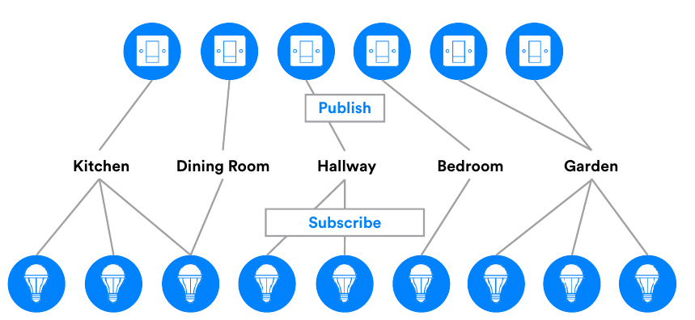

# Bluetooth Mesh — The Basics

## Mesh vs. Point-to-Point

Most Bluetooth LE devices communicate with each other using a simple point-to-point network topology enabling one-to-one device communications. In the Bluetooth core specification, this is called a ‘piconet.’ 

Imagine a smartphone that has established a point-to- point connection to a heart rate monitor over which it can transfer data. One nice aspect of Bluetooth is that it enables devices to set up multiple connections. **That same smartphone can also establish a point-to- point connection with an activity tracker. In this case, the smartphone can communicate directly with each of the other devices, but the other devices cannot communicate directly with each other.** 

In contrast, a **mesh network has a many-to-many topology, with each device able to communicate with every other device in the mesh**. Communication is achieved using messages, and devices are able to relay messages to other devices so that the end-to-end communication range is extended far beyond the radio range of each individual node.

## Devices and Nodes

**Devices** which are part of a mesh network are called **nodes** and those which are not are called “**unprovisioned devices**”.

The process which transforms an unprovisioned device into a node is called “**provisioning**”. Consider purchasing a new Bluetooth light with mesh support, bringing it home and setting it up. To make it part of your mesh network, so that it can be controlled by your existing Bluetooth light switches and dimmers, you would need to provision it. 

Provisioning is a secure procedure which results in **an unprovisioned device possessing a series of encryption keys** and being known to the Provisioner device, typically a tablet or smartphone. One of these keys is called the **network key or NetKey for short**. 

All nodes in a mesh network possess at least one NetKey and it is possession of this key which makes a device a member of the corresponding network and as such, a node. There are other requirements that must be satisfied before a node can become useful, but **securely acquiring a NetKey through the provisioning process is a fundamental first step**. 

## Elements

Some nodes have multiple, constituent parts, **each of which can be independently controlled**. In Bluetooth mesh terminology, these parts are called **elements**. For example, an LED lighting product with three LED lights which if added to a Bluetooth mesh network, would form a single node with three elements, one for each of the individual LED lights.

## Messages 

When a node needs to query the status of other nodes or needs to control other nodes in some way, it sends a message of a suitable type. If a node needs to report its status to other nodes, it sends a message. **All communication in the mesh network is “message-oriented” and many message types are defined, each with its own, unique opcode.** 

Messages fall within one of two broad categories; **acknowledged or unacknowledged.** 

**Acknowledged messages** require a response from nodes that receive them. The response serves two purposes: it confirms that the message it relates to was received, and it returns data relating to the message recipient to the message sender. 

The sender of an acknowledged message may resend the message if it does not receive the expected response\(s\) and therefore, acknowledged messages must be idempotent. This means that the effect of a given acknowledged message, arriving at a node multiple times, will be the same as it had only been received once. 

**Unacknowledged messages** do not require a response.

## Addresses 

Messages must be sent from and to an address. Bluetooth mesh defines three types of address. 

**A unicast address** uniquely identifies a single element. Unicast addresses are assigned to devices during the provisioning process. 

**A group address** is a multicast address which represents one or more elements. Group addresses are either defined by the Bluetooth Special Interest Group \(SIG\) and are known as SIG Fixed Group Addresses or are assigned dynamically. 4 SIG Fixed Group Addresses have been defined. These are named All-proxies, All-friends, All-relays and All-nodes. The terms Proxy, Friend, and Relay will be explained later in this paper. 

It is expected that dynamic group addresses will be established by the user via a configuration application and that they will reflect the physical configuration of a building, such as defining group addresses which correspond to each room in the building. 

**A virtual address** is an address which may be assigned to one or more elements, spanning one or more nodes. It takes the form of a 128-bit UUID value with which any element can be associated and is much like a label.

Virtual addresses will likely be preconfigured at the point of manufacture and be used for scenarios such as allowing the easy addressing of all meeting room projectors made by this manufacturer.

## Publish/Subscribe 

The act of sending a message is known as **publishing**. Nodes are configured to select messages sent to specific addresses for processing, and this is known as **subscribing**. 

Typically, messages are addressed to group or virtual addresses. Group and virtual address names will have readily understood meaning to the end user, making them easy and intuitive to use. In Figure 4, above, we can see that the node “Switch 1” is publishing to group address Kitchen. Nodes Light 1, Light 2, and Light 3 each subscribe to the Kitchen address and therefore receive and process messages published to this address. In other words, Light 1, Light 2, and Light 3 can be switched on or off using Switch 1. 

Switch 2 publishes to the group address Dining Room. Light 3 alone subscribed to this address and so is the only light controlled by Switch 2. Note that this example Figure 4 - Publish/Subscribe also illustrates the fact that nodes may subscribe to messages addressed to more than one distinct address. This is both powerful and flexible. 

Similarly, notice how both nodes Switch 5 and Switch 6 publish to the same Garden address. 

The use of group and virtual addresses with the publish/ subscribe communication model has an additional, substantial benefit in that removing, replacing or adding new nodes to the network does not require reconfiguration of other nodes. Consider what would be involved in installing an additional light in the dining room. The new device would be added to the network using the provisioning process and configured to subscribe to the Dining Room address. No other nodes would be affected by this change to the network. Switch 2 would continue to publish messages to Dining Room as before but now, both Light 3 and the new light would respond.

## States and Properties 

Elements can be in various conditions and this is represented in Bluetooth mesh by the **concept of state** values.

**A state is a value of a certain type, contained within an element** \(within a server model - see below\). As well as values, States also have associated behaviors and may not be reused in other contexts. 

As an example, consider a simple light which may either be on or off. **Bluetooth mesh defines a state called Generic OnOff**. The light would possess this state item and a value of On would correspond to and cause the light to be illuminated whereas a Generic OnOff state value of Off would reflect and cause the light to be switched off. 

The significance of the term Generic will be discussed later. 

**Properties are similar to states** in that they contain values relating to an element. But they are significantly different to states in other ways. 

Readers who are familiar with Bluetooth LE will be aware of characteristics and recall that they are data types with no defined behaviors associated with them, making them reusable across different contexts. A property provides the context for interpreting a characteristic. 

To appreciate the significance and use of contexts as they relate to properties, consider for example, the characteristic **Temperature 8, an 8-bit temperature** _**state**_ **type which has a number of associated** _**properties**_**, including Present Indoor Ambient Temperature and Present Outdoor Ambient Temperature.** These two properties allow a sensor to publish sensor readings in a way that allows a receiving client to determine the context the temperature value has, making better sense of its true meaning. 

**Properties are organized into two categories: Manufacturer, which is a read-only category and Admin which allows read-write access.**

## Messages, States and Properties

**Messages are the mechanism by which operations on the mesh are invoked.** Formally, a given message type represents an operation on a state or collection of multiple state values. All messages are of three broad types, reflecting the types of operation which Bluetooth mesh supports. The shorthand for the three types is **GET**, **SET** and **STATUS**. 

**GET** messages **request the value of a given state** from one or more nodes. A STATUS message is sent in response to a GET and contains the relevant state value. 

**SET** messages **change the value of a given state**. An acknowledged SET message will result in a STATUS message being returned in response to the SET message whereas an unacknowledged SET message requires no response. 

**STATUS** messages are sent in response to GET messages, acknowledged SET messages or independently of other messages, perhaps driven by a timer running on the element sending the message, for example. 

**Specific states referenced by messages are inferred from the message opcode. Properties on the other hand, are referenced explicitly in generic property related messages using a 16-bit property ID.** 

## State Transitions 

**Changes from one state to another are called state transitions.** Transitions may be instantaneous or execute over a period of time called the transition time. A state transition is likely to have an effect on the application layer behavior of a node. 

## Bound States 

**Relationships may exist between states whereby a change in one triggers a change in the other.** Such a relationship is called a **state binding**. One state may be bound to multiple other states.

For example, consider a light controlled by a dimmer switch. The light would possess the two states, Generic OnOff and Generic Level with each bound to the other. Reducing the brightness of the light until Generic Level has a value of zero \(fully dimmed\) results in Generic OnOff transitioning from On to Off. 

## Models 

**Models pull the preceding concepts together and define some or all of the functionality of an element as it relates to the mesh network.** Three categories of model are recognized. 

A **server model** defines a collection of states, state transitions, state bindings and messages which the element containing the model may send or receive. It also defines behaviors relating to messages, states and state transitions. 

A **client model** does not define any states. Instead, it defines the messages which it may send or receive in order to GET, SET or acquire the STATUS of states defined in the corresponding server model. 

**Control models** contain both a server model, allowing communication with other client models and a client model which allows communication with server models. 

**Models may be created by extending other models.** A model which is not extended is called a root model. 

**Models are immutable**, meaning that they may not be changed by adding or removing behaviors. The correct and only permissible approach to **implementing new model requirements is to extend the existing model**. 

## Generics 

It is recognized that many different types of device, often have semantically equivalent states, as exemplified by the simple idea of ON vs OFF. Consider lights, fans and power sockets, all of which can be switched on or turned off. 

Consequently, the Bluetooth mesh model specification, defines a series of reusable, generic states such as, for example, Generic OnOff and Generic Level. 

Similarly, a series of generic messages that operate on the generic states are defined. Examples include Generic OnOff Get and Generic Level Set. 

Generic states and generic messages are used in generalized models, both generic server models such as the Generic OnOff Server and Generic Client Models such as the Generic Level Client. 

Generics allow a wide range of device type to support Bluetooth mesh without the need to create new models. Remember that models may be created by extending other models too. As such, generic models may form the basis for quickly creating models for new types of devices.

## Scenes 

A scene is a stored collection of states which may be recalled and made current by the receipt of a special type of message or at a specified time. Scenes are identified by a 16-bit Scene Number, which is unique within the mesh network. Scenes allow a series of nodes to be set to a given set of previously stored, complimentary states in one coordinated action.

Imagine that in the evening, you like the temperature in your main family room to be 20 degrees Celsius, the six LED downlights to be at a certain brightness level and the lamp in the corner of the room on the table, set to a nice warm yellow hue. Having manually set the various nodes in this example scenario to these states, you can store them as a scene using a configuration application, and recall the scene later on, either on demand by sending an appropriate, scene-related mesh message or automatically at a scheduled time. 

## Provisioning 

Provisioning is the process by which a device joins the mesh network and becomes a node. It involves several stages, results in various security keys being generated and is itself a secure process. 

Provisioning is accomplished using an application on a device such as a tablet. In this capacity, the device used to drive the provisioning process is referred to as the Provisioner. 

The provisioning process progresses through five steps and these are described next. 

### **Step 1. Beaconing** 

In support of various different Bluetooth mesh features, including but not limited to provisioning, new GAP AD types \(ref: Bluetooth Core Specification Supplement\) have been introduced, including the &lt;&gt; AD type. 

An unprovisioned device indicates its availability to be provisioned by using the &lt;&gt; AD type in advertising packets. The user might need to start a new device advertising in this way by, for example, pressing a combination of buttons or holding down a button for a certain length of time. 

### **Step 2. Invitation** 

In this step, the Provisioner sends an invitation to the device to be provisioned, in the form of a Provisioning Invite PDU. The Beaconing device responds with information about itself in a Provisioning Capabilities PDU. 

### **Step 3. Exchanging Public Keys** 

The Provisioner and the device to be provisioned, exchange their public keys, which may be static or ephemeral, either directly or using an out-of-band \(OOB\) method. 

### **Step 4. Authentication** 

During the authentication step, the device to be provisioned outputs a random, single or multi-digit number to the user in some form, using an action appropriate to its capabilities. For example, it might flash an LED several times. The user enters the digit\(s\) output by the new device into the Provisioner and a cryptographic exchange takes place between the two devices, involving the random number, to complete the authentication of each of the two devices to the other. 

### **Step 5. Distribution of the Provisioning Data**

After authentication has successfully completed, a session key is derived by each of the two devices from their private keys and the exchanged, peer public keys. The session key is then used to secure the subsequent distribution of the data required to complete the provisioning process, including a security key known as the network key \(NetKey\). 

After provisioning has completed, the provisioned device possesses the network’s NetKey, a mesh security parameter known as the IV Index and a Unicast Address, allocated by the Provisioner. It is now known as a node.

## Features 

All nodes can transmit and receive mesh messages but there are a number of optional features which a node may possess, giving it additional, special capabilities. There are four such optional features: the Relay, Proxy, Friend, and the Low Power features. A node may support zero or more of these optional features and any supported feature may, at a point in time, be enabled or disabled. 

### Relay Nodes 

Nodes which support the Relay feature, known as Relay nodes, are able to retransmit received messages. Relaying is the mechanism by which a message can traverse the entire mesh network, making multiple “hops” between devices by being relayed. 

Mesh network PDUs include a field called TTL \(Time To Live\). It takes an integer value and is used to limit the number of hops a message will make across the network. Setting TTL to 3, for example, will result in the message being relayed, a maximum number of three hops away from the originating node. Setting it to 0 will result in it not being relayed at all and only traveling a single hop. Armed with some basic knowledge of the topology and membership of the mesh, nodes can use the TTL field to make more efficient use of the mesh network. 

### Low Power Nodes and Friend Nodes 

Some types of node have a limited power source and need to conserve energy as much as possible. Furthermore, devices of this type may be predominantly concerned with sending messages but still have a need to occasionally receive messages. 

Consider a temperature sensor which is powered by a small coin cell battery. It sends a temperature reading once per minute whenever the temperate is above or below configured upper and lower thresholds. If the temperature stays within those thresholds it sends no messages. These behaviors are easily implemented with no particular issues relating to power consumption arising. 

However, the user is also able to send messages to the sensor which change the temperature threshold state values. This is a relatively rare event but the sensor must support it. The need to receive messages has implications for duty cycle and as such power consumption. A 100% duty cycle would ensure that the sensor did not miss any temperature threshold configuration messages but use a prohibitive amount of power. A low duty cycle would conserve energy but risk the sensor missing configuration messages. 

The answer to this apparent conundrum is the Friend node and the concept of friendship. 

Nodes like the temperature sensor in the example may be designated Low Power nodes \(LPNs\) and a feature flag in the sensor’s configuration data will designate the node as such. 

LPNs work in tandem with another node, one which is not power-constrained \(e.g. it has a permanent AC power source\). This device is termed a Friend node. The Friend stores messages addressed to the LPN and delivers them to the LPN whenever the LPN polls the Friend node for “waiting messages”. The LPN may poll the Friend relatively infrequently so that it can balance its need to conserve power with the timeliness with which it needs to receive and process configuration messages. When it does poll, all messages stored by the Friend are forwarded to the LPN, one after another, with a flag known as MD \(More Data\) indicating to the LPN whether there are further messages to be sent from the Friend node. 

The relationship between the LPN and the Friend node is known as friendship. Friendship is key to allowing very power constrained nodes which need to receive messages, to function in a Bluetooth mesh network whilst continuing to operate in a power-efficient way. 

### Proxy Nodes 

There are an enormous number of devices in the world that support Bluetooth LE, most smartphones and tablets being amongst them. In-market Bluetooth devices, at the time Bluetooth mesh was adopted, do not possess a Bluetooth mesh networking stack. They do possess a Bluetooth LE stack however and therefore have the ability to connect to other devices and interact with them using GATT, the Generic Attribute Profile. 

Proxy nodes expose a GATT interface which Bluetooth LE devices may use to interact with a mesh network. A protocol called the Proxy Protocol, intended to be used with a connection-oriented bearer, such as GATT is defined. GATT devices read and write Proxy Protocol PDUs from within GATT characteristics implemented by the Proxy node. The Proxy node transforms these PDUs to/from mesh PDUs. 

In summary, Proxy nodes allow Bluetooth LE devices that do not possess a Bluetooth mesh stack to interact with nodes in a mesh network. 

## Node Configuration 

Each node supports a standard set of configuration states which are implemented within the standard Configuration Server Model and accessed using the Configuration Client Model. Configuration State data is concerned with the node’s capabilities and behavior within the mesh, independently of any specific application or device type behaviors. 

For example, the features supported by a node, whether it is a Proxy node, a Relay node and so on, are indicated by Configuration Server states. The addresses to which a node has subscribed are stored in the Subscription List. The network and subnet keys indicating the networks the node is a member of are listed in the configuration block, as are the application keys held by the mode. 

A series of configuration messages allow the Configuration Client Model and Configuration Server Model to support GET, SET and STATUS operations on the Configuration Server Model states.

