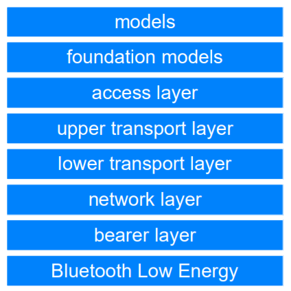

# Mesh System Architecture

## Overview

At the bottom of the mesh architecture stack, we have a layer entitled Bluetooth LE. In fact, this is more than just a single layer of the mesh architecture, it’s the **full Bluetooth LE stack**, which is required to **provide fundamental wireless communications capabilities** which are leveraged by the mesh architecture which sits on top of it. It should be clear that the mesh system is dependent upon the availability of a Bluetooth LE stack.

We’ll now review each layer of the mesh architecture, working our way up from the bottom layer.

> 在 Mesh 协议栈的底部，我们有一个名为低功耗蓝牙的层。实际上，这不仅仅是 Mesh 架构的单层，而是完整的低功耗蓝牙协议栈，它是提供基本无线通信功能所必需的，而基础层上的 Mesh 架构则可以利用这些功能。应该清楚的是，Mesh 系统取决于低功耗蓝牙协议栈栈的可用性。
>
> 现在，我们将从底层开始逐层查看 Mesh 架构的每一层。

## Bearer Layer

Mesh messages require an underlying communications system for their transmission and receipt. **The bearer layer defines how mesh PDUs will be handled by a given communications system.** At this time, two bearers are defined and these are called the **Advertising Bearer** and the **GATT Bearer**.

The **Advertising Bearer** leverages Bluetooth LE’s GAP advertising and scanning features to convey and receive mesh PDUs.

The **GATT Bearer** allows a device which does not support the Advertising Bearer to communicate indirectly with nodes of a mesh network which do, using a protocol known as the **Proxy Protocol**. The Proxy Protocol is encapsulated within GATT operations involving specially defined GATT characteristics. **A mesh Proxy node** implements these GATT characteristics and supports the GATT bearer as well as the Advertising Bearer so that it can convert and relay messages between the two types of bearer.

> Mesh 消息需要基础通信系统进行发送和接收。承载层定义给定通信系统如何处理 Mesh PDU。此时，定义了两个承载层，它们分别称为广播承载层和 GATT 承载层。
>
> 广播承载层利用低功耗蓝牙的 GAP 广播和扫描功能来发送和接收 Mesh PDU。
>
> GATT 承载层允许不支持广播承载层的设备使用代理协议与 Mesh 网络的节点间接通信。代理协议封装在专门定义的 GATT 特性的 GAT T操作中。Mesh 代理节点实现了这些 GATT 特性，并支持 GATT 承载层以及广播承载，因此它可以在两种类型的承载层之间转换和中继消息。

## Network Layer

**The network layer defines the various message address types and a network message format which allows transport layer PDUs to be transported by the bearer layer.**

It can support multiple bearers, each of which may have multiple network interfaces, including the **local interface** which is used for communication between elements that are part of the same node.

**The network layer determines which network interface\(s\) to output messages over.** An input filter is applied to messages arriving from the bearer layer, to determine whether or not they should be delivered to the network layer for further processing. Output messages are subject to an output filter to control whether or not they are dropped or delivered to the bearer layer.

**The Relay and Proxy features may be implemented by the network layer.**

> 网络层定义了各种消息地址类型和 Mesh 消息格式，该格式允许承载层传输传输层 PDU。
>
> 它可以支持多个承载层，每个承载层可以具有多个网络接口，包括用于在同一节点内的元素之间进行通信的本地接口。
>
> 网络层确定通过哪个网络接口输出消息。输入过滤器应用于从承载层到达的消息，以确定是否应将它们传递到网络层以进行进一步处理。输出消息受输出过滤器的控制，以控制是否将其丢弃或传递到承载层。
>
> 中继和代理功能可以由网络层实现。

## Lower Transport Layer

**The lower transport layer takes PDUs from the upper transport layer and sends them to the lower transport layer on a peer device.** Where required, it performs **segmentation** and **reassembly** of PDUs. For longer packets, which will not fit into a single Transport PDU, the lower transport layer will perform segmentation, splitting the PDU into multiple Transport PDUs. The receiving lower transport layer on the other device, will reassemble the segments into a single upper transport layer PDU and pass this up the stack.

> 下层传输层从上层传输层获取 PDU，并将其发送到对等设备上的下层传输层。在需要时，它将对 PDU 进行分段和重组。对于较长的数据包（不适用于单个传输 PDU），下层传输层将执行分段，将 PDU 拆分为多个传输 PDU。另一个接收设备上的下层传输层将把这些段重新组装成一个上层传输层 PDU，并将其向上传递到堆栈中。

## Upper Transport Layer

**The upper transport layer is responsible for the encryption, decryption and authentication of application data passing to and from the access layer.** It also has responsibility for **transport control messages**, which are internally generated and sent between the upper transport layers on different peer nodes. These include messages related to **friendship** and **heartbeats**.

> 上层传输层负责对进出访问控制层的应用程序数据进行加密，解密和身份验证。它还负责传输控制消息，该消息在内部生成并在不同对等节点上的上层传输层之间发送。其中包括与友谊和心跳有关的消息。

## Access Layer

**The access layer is responsible for defining how applications can make use of the upper transport layer.** This includes:

* Defining the **format** of application data. 
* **Defining and controlling the encryption and decryption process** which is performed in the upper transport layer. 
* **Verifying that data** received from the upper transport layer is for the right network and application, before forwarding the data up the stack.

> 访问控制层负责定义应用程序如何利用上层传输层。 这包括：
>
> * 定义应用程序数据的格式。
> * 定义和控制在上层传输层中执行的加密和解密过程。
> * 在向上将数据转发到协议栈之前，验证从上层传输层收到的数据是否适用于正确的网络和应用程序。

## Foundation Models Layer

**The foundation model layer is responsible for the implementation of those models concerned with the configuration and management of a mesh network.**

> 基础模型层负责实现与 Mesh 网络的配置和管理有关的那些模型。

## Models Layer

**The model layer is concerned with the implementation of Models and as such, the implementation of behaviors, messages, states, state bindings and so on, as defined in one or more model specifications.**

> 模型层与模型的实现有关，因此，与一个或多个模型规范中定义的行为，消息，状态，状态绑定等的实现有关。

